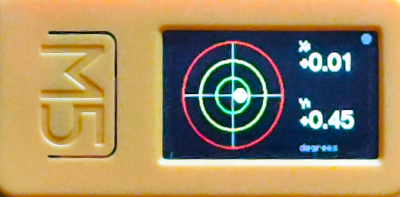
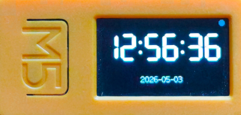
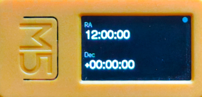
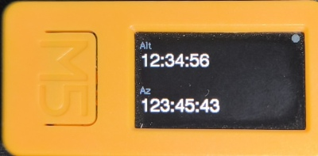

# M5StickC Plus 2 Bluetooth Clinometer

A BLE-enabled clinometer and telescope status display for the M5StickC Plus 2 (ESP32). Used to align a NexStar Alt/Az GoTo telescope mount and display live coordinates sent from a Raspberry Pi.









## What it does

- Shows a live **bubble level** (clinometer) based on the built-in IMU — used to level the telescope mount
- Displays **time**, **RA/Dec**, and **Alt/Az** coordinates pushed from the Raspberry Pi over BLE
- Exposes a **BLE GATT service** so a Raspberry Pi can query tilt angles and update the displayed data at any time, regardless of which screen is active
- Supports **operator messages** — the Pi can push short text to the display, optionally waiting for a button acknowledgement
- Supports **night mode** — switches all display colours to red/orange-red to preserve dark-adapted vision at the eyepiece

## Hardware

| Item | Detail |
|---|---|
| Reference device | M5StickC Plus 2 |
| MCU | ESP32 |
| Display | ST7789 135×240 LCD (landscape: 240×135); layout adapts to other resolutions |
| IMU | MPU6886 6-axis accelerometer/gyroscope |
| PMIC | AXP2101 (battery management) |
| Communication | Bluetooth Low Energy (BLE 4.2) |

## Building

This is a [PlatformIO](https://platformio.org/) project targeting the Arduino framework. Use the `flash` script to build and upload in one step:

```bash
./flash                  # build + flash to m5stickc-plus2 (default)
./flash m5stickc-plus2
./flash m5stack-core2
./flash m5stack-cores3
./flash -h               # show usage
```

Compilation is incremental — only changed files are recompiled. The script replaces the old separate `build` and `deploy` scripts.

### Supported board environments

| Environment | Board | Platform |
|---|---|---|
| `m5stickc-plus2` | M5StickC Plus 2 | espressif32 @ 6.1.0 |
| `m5stack-core2` | M5Stack Core2 | espressif32 @ 6.1.0 |
| `m5stack-cores3` | M5Stack CoreS3 | espressif32 @ 7.x |

The source uses **M5Unified** (`m5stack/M5Unified`) rather than the device-specific `M5StickCPlus2` library. `M5.Imu.isEnabled()` and `M5.Speaker.isEnabled()` guards are used throughout so the firmware degrades gracefully on boards that lack an IMU or speaker — the clinometer screen shows `IMU N/A` and BEEP commands are silently skipped. The display layout adapts to the actual screen dimensions reported by `M5.Display` after `setRotation()`: all pixel coordinates, margins, bar sizes, and bubble radii are derived from `width()` and `height()` at start-up, so the same code renders correctly on the M5StickC Plus 2 (240×135) and on larger displays such as the Core2 or CoreS3 (320×240).

### CoreS3 note

CoreS3 uses ESP32-S3, which requires `espressif32@7.x`. PlatformIO downloads it automatically on first build for that environment. You also need `intelhex` in PlatformIO's own virtualenv:

```bash
~/.platformio/penv/bin/pip install intelhex
```

## Screens

The **M5 front button** cycles through screens in order:

| # | Screen | Description |
|---|---|---|
| 0 | Clinometer | Bubble level with 1°/2°/3° rings, numeric X/Y tilt readout |
| 1 | Time | Current time (HH:MM:SS) — solar or sidereal — and date or label set via BLE |
| 2 | RA/Dec | Right Ascension and Declination from the telescope |
| 3 | Alt/Az | Altitude and Azimuth from the telescope |
| 4 | Battery | Charge bar with colour coding, voltage (V) and level (%) |
| — | Message | Temporary full-screen overlay triggered by BLE command |

## Button behaviour

| Button | Short press | Long press (≥2 s) |
|---|---|---|
| M5 (front) | Cycle to next screen | — |
| Top (side) | Reboot | Power off (AXP192 shutdown) |
| Power (reserved) | — | — |

When a `SHOW_MSG_WAIT` message is active, pressing the M5 button (if it is in the watch list) sends a `EVENT BUTTON M5` notification over BLE instead of cycling screens.

---

## BLE Interface

### Connection parameters

| Parameter | Value |
|---|---|
| Device name | `M5-NexStar-Level` |
| Role | Peripheral / GATT server |
| MTU | 185 bytes (requested) |
| Default mode | Request / reply (no streaming unless enabled) |

The device advertises continuously. After a central disconnects, advertising restarts automatically.

### GATT service

**Service UUID:** `7d91b000-8f3b-4b63-b6a4-5d1e6b7a1000`

| Characteristic | UUID | Properties | Purpose |
|---|---|---|---|
| Command | `7d91b001-8f3b-4b63-b6a4-5d1e6b7a1000` | Write, Write Without Response | Pi → device: send a command |
| Response | `7d91b002-8f3b-4b63-b6a4-5d1e6b7a1000` | Read, Notify | Device → Pi: command replies and async events |
| Status | `7d91b003-8f3b-4b63-b6a4-5d1e6b7a1000` | Read | Compact device state snapshot (polled, no notify) |

### Protocol

Commands and responses are **ASCII text**, one per write/notify. Fields are space-separated.

**Newline framing (optional):** If a client sends commands that end with `\n` (or `\r\n`), the device detects this on the first such command and appends `\n` to every subsequent reply and async notification for that connection. This makes the stream appear as newline-delimited text to clients that treat BLE as a byte stream. Clients that send commands without a trailing `\n` receive plain responses with no terminator. The flag is sticky for the lifetime of a connection and resets on disconnect.

Subscribe to notifications on the **Response** characteristic to receive replies and asynchronous events (button presses, screen changes). The device sends one notify per command reply.

---

## BLE Commands

### `HELP`

Returns a concise list of all accepted commands. The device sends one notify packet per command line, each prefixed with `HELP `, followed by a `HELP OK` sentinel that signals the list is complete.

```
→ HELP
← HELP PING
← HELP GET_TILT
← HELP GET_STATUS
← HELP GET_TIME
← HELP GET_RADEC
← HELP GET_ALTAZ
← HELP GET_MSG
← HELP SET_TIME <ISO8601> [<tz>]
← HELP SET_SIDEREAL_TIME <HH:MM:SS> [<label>]
← HELP SET_RADEC <ra> <dec>
← HELP SET_ALTAZ <alt> <az>
← HELP SHOW_MSG <dur> <text...>
← HELP SHOW_MSG_WAIT <dur> <btns> <text...>
← HELP CANCEL_MSG
← HELP START_STREAM <ms>
← HELP STOP_STREAM
← HELP SET_NIGHT_MODE ON|OFF
← HELP BEEP [<notes...>]
← HELP HELP
← HELP OK
```

Clients should subscribe to notifications and collect packets until they receive `HELP OK`. `?` is accepted as a synonym.

---

### `PING`

Returns a liveness acknowledgement.

```
→ PING
← OK PONG
```

---

### `GET_TILT`

Returns the current X (pitch) and Y (roll) tilt angles in decimal degrees.

```
→ GET_TILT
← TILT +0.42 -1.17
```

The sign convention follows the physical orientation of the device. Values update at ~15 Hz internally; the response reflects the most recent sample.

---

### `GET_STATUS`

Returns a one-line summary of device state.

```
→ GET_STATUS
← STATUS SCREEN=CLINOMETER BLE=1 STREAM=0 BAT=3.96 NIGHT=0
```

| Field | Values | Description |
|---|---|---|
| `SCREEN` | `CLINOMETER` `TIME` `RADEC` `ALTAZ` `BATTERY` `MESSAGE` | Active screen |
| `BLE` | `0` `1` | BLE connected flag |
| `STREAM` | `0` `1` | Tilt streaming enabled |
| `BAT` | float volts | Battery voltage (AXP2101) |
| `NIGHT` | `0` `1` | Night mode enabled |

---

### `GET_TIME`

Returns the current time as set by `SET_TIME`, ticking locally since then.

```
→ GET_TIME
← TIME 2026-04-19T18:42:10Z
```

Returns `TIME NONE` if time has not been set since boot.

---

### `GET_RADEC`

Returns the stored RA/Dec strings.

```
→ GET_RADEC
← RADEC 12:34:56 +07:08:09
```

Returns `--:--:--` placeholders until set by `SET_RADEC`.

---

### `GET_ALTAZ`

Returns the stored Alt/Az strings.

```
→ GET_ALTAZ
← ALTAZ +43.2 181.7
```

Returns `---` placeholders until set by `SET_ALTAZ`.

---

### `GET_MSG`

Returns the current message state.

```
→ GET_MSG
← MSG NONE

← MSG ACTIVE INF BUTTONS=M5 TEXT=Press M5 to continue
← MSG ACTIVE 4 BUTTONS=NONE TEXT=Moving altitude axis
```

The second field is the remaining lifetime in seconds, or `INF` for a persistent message.

---

### `SET_TIME <iso8601> [<tz>]`

Sets the device clock. The device ticks locally from this point.

```
→ SET_TIME 2026-05-14T12:30:00Z
← OK TIME

→ SET_TIME 2026-05-14T12:30:00+01:00
← OK TIME

→ SET_TIME 2026-05-14T12:30:00 CET
← OK TIME

← ERR BAD_TIME
```

The datetime part is always `YYYY-MM-DDTHH:MM:SS` and is stored at face value — the device performs no UTC conversion. The optional timezone label is display-only: it appears on the time screen below the date and is not interpreted by the firmware.

| Suffix | Label shown | Example |
|---|---|---|
| `Z` | `UTC` | `2026-05-14T12:30:00Z` |
| `+HH:MM` / `-HH:MM` | the offset string | `2026-05-14T12:30:00+01:00` |
| separate token | the token | `2026-05-14T12:30:00 CET` |
| (none) | nothing | `2026-05-14T12:30:00` |

No DST logic is applied; the timezone string is purely informational.

---

### `SET_SIDEREAL_TIME <HH:MM:SS> [<label>]`

Switches the device clock to sidereal mode, advancing at the sidereal rate (≈ 366.2422/365.2422 × solar rate). The calendar date is suppressed on screen; the label (default `LST`) is shown in its place.

```
→ SET_SIDEREAL_TIME 14:32:00
← OK SIDEREAL

→ SET_SIDEREAL_TIME 14:32:00 LST
← OK SIDEREAL

← ERR BAD_TIME
← ERR BAD_ARGS
```

Time is stored at face value and ticked forward at the sidereal rate. Use `SET_TIME` to leave sidereal mode and return to solar time.

---

### `SET_RADEC <ra> <dec>`

Updates the RA/Dec values shown on the RA/Dec screen.

```
→ SET_RADEC 12:34:56 +07:08:09
← OK RADEC
← ERR BAD_ARGS
```

RA is `HH:MM:SS`. Dec is `+/-DD:MM:SS`. Values are stored as display strings; no range validation is performed.

---

### `SET_ALTAZ <alt> <az>`

Updates the Alt/Az values shown on the Alt/Az screen.

```
→ SET_ALTAZ +43.2 181.7
← OK ALTAZ
← ERR BAD_ARGS
```

Both values are decimal degrees. Values are stored as display strings.

---

### `SHOW_MSG <duration> <text>`

Displays a message on the full-screen message overlay.

```
→ SHOW_MSG 5 Moving altitude axis
→ SHOW_MSG INF Waiting for solar centering
← OK MSG
← ERR BAD_ARGS
```

| `<duration>` | Meaning |
|---|---|
| Integer (seconds) | Message auto-dismisses after this many seconds |
| `INF` | Message persists until `CANCEL_MSG` or a replacement |

The device switches to the message screen immediately and returns to the previous screen when the message expires or is cancelled. BLE and IMU continue running in the background.

---

### `SHOW_MSG_WAIT <duration> <buttons> <text>`

Displays a message and registers interest in one or more button presses. When a watched button is pressed, the device sends an `EVENT BUTTON <x>` notification.

```
→ SHOW_MSG_WAIT 30 M5 Press M5 when ready
→ SHOW_MSG_WAIT INF M5,A Confirm or abort
→ SHOW_MSG_WAIT 15 ANY Press any button to stop
← OK MSG_WAIT
← ERR BAD_ARGS
```

**Button mask values:**

| Value | Meaning |
|---|---|
| `M5` | Front M5 button |
| `A` | Top side button |
| `B` | Power/third button |
| `M5,A` | Comma-separated combination |
| `ANY` | Any of the three buttons |

The message remains visible after a button press until its timeout expires or `CANCEL_MSG` is received. Multiple button events can be generated if the user presses the button more than once.

---

### `CANCEL_MSG`

Dismisses the active message immediately and returns to the previous screen.

```
→ CANCEL_MSG
← OK MSG_CANCEL
```

Has no effect if no message is active (still returns `OK MSG_CANCEL`).

---

### `START_STREAM <period_ms>`

Enables periodic tilt notifications on the Response characteristic. The device sends a `TILT` line every `<period_ms>` milliseconds without waiting for a request.

```
→ START_STREAM 500
← OK STREAM 500
```

Minimum period is 100 ms. Streaming continues until `STOP_STREAM` or disconnection.

---

### `STOP_STREAM`

Disables tilt streaming.

```
→ STOP_STREAM
← OK STREAM 0
```

---

### `SET_NIGHT_MODE <on|off>`

Switches the display into night mode (or back to normal). In night mode all display colours are shifted to the red family to preserve dark-adapted vision at the telescope eyepiece. Elements that were previously green (1° clinometer ring, battery-good fill, BLE-connected indicator) are rendered in a warm orange-red to retain visual hierarchy; all other non-black colours use pure red.

```
→ SET_NIGHT_MODE ON
← OK NIGHT_MODE ON

→ SET_NIGHT_MODE OFF
← OK NIGHT_MODE OFF

← ERR BAD_ARGS   (if argument is missing or not ON/OFF)
```

Night mode persists until explicitly disabled or the device reboots. The current state is reported by `GET_STATUS` as `NIGHT=1` / `NIGHT=0`.

---

### `BEEP [note ...]`

Plays a beep or a melody through the built-in speaker. The response is returned immediately while the melody plays asynchronously.

```
→ BEEP
← OK BEEP

→ BEEP C'4 G8 -16 G8 A4 G4 -2 B4 C'4
← OK BEEP

→ BEEP C4 Z4
← BAD MELODY @4   (unrecognised note token; @N is 1-based position in melody string)
```

With no arguments the device emits a single short attention beep (880 Hz, 200 ms). With note tokens it plays the sequence as a melody.

**Note token format:** `<letter>[accidental][octave][duration][dot]`

Each token is a space-separated note or rest:

| Part | Syntax | Meaning |
|---|---|---|
| Letter | `A` `B` `C` `D` `E` `F` `G` | Note name (case-insensitive) |
| Rest | `-` | Silence for the given duration |
| Sharp / flat | `#` or `b` after letter | Raise or lower by one semitone |
| Octave up | `'` (one or more) after accidental | Each `'` raises the note by one octave |
| Octave down | `,` (one or more) after accidental | Each `,` lowers the note by one octave |
| Duration | `1` `2` `4` `8` `16` | Whole, half, quarter, eighth, sixteenth; default `4` |
| Dotted | `.` after duration | Multiplies duration by 1.5 |

Bare letter names (no `'` or `,`) are in the middle register. A single `'` shifts up one octave from there; a single `,` shifts down one octave. Multiple marks stack: `C''` is two octaves above the middle C, `C,,` is two below.

**Examples:**

| Token | Meaning |
|---|---|
| `C` | Middle C, quarter note |
| `C'` | One octave above middle C, quarter note |
| `C,` | One octave below middle C, quarter note |
| `G#8` | G sharp, eighth note |
| `Bb2` | B flat, half note |
| `C4.` | Dotted quarter (1.5× duration) |
| `-4` | Quarter-note rest |

"Shave And A Hair Cut":

```
BEEP C'4 G8 -16 G8 A4 G4 -2 B4 C'4
```

Up to 32 notes per command.

---

## Asynchronous Events

The device can send unsolicited notifications on the Response characteristic. Subscribe to notifications to receive them.

### Screen change events

Sent whenever the active screen changes (button press, message activation/expiry, or BLE command). Clients can use this to pause or resume periodic `SET_RADEC` / `SET_ALTAZ` updates when those screens are not visible.

```
EVENT SCREEN CLINOMETER
EVENT SCREEN TIME
EVENT SCREEN RADEC
EVENT SCREEN ALTAZ
EVENT SCREEN BATTERY
EVENT SCREEN MESSAGE
```

### Button events

Sent when a button is pressed that is listed in the current `SHOW_MSG_WAIT` button mask.

```
EVENT BUTTON M5
EVENT BUTTON A
EVENT BUTTON B
```

### Streaming tilt

When `START_STREAM` is active, periodic tilt notifications are sent in the same format as `GET_TILT`:

```
TILT +0.38 -1.12
```

---

## Error responses

| Response | Meaning |
|---|---|
| `ERR UNKNOWN_COMMAND` | Command token not recognised |
| `ERR BAD_ARGS` | Wrong number or format of arguments |
| `ERR BAD_TIME` | `SET_TIME` value could not be parsed |
| `BAD MELODY @N` | `BEEP` received an unrecognised note token; `N` is the 1-based byte offset within the melody argument |

---

## Status characteristic

The Status characteristic (`7d91b003-...`) is a read-only snapshot updated every ~2 seconds. It does not issue notifications; poll it when needed.

```
SCREEN=CLINOMETER;BLE=1;BAT=3.96;STREAM=0
```

---

## Python tools

Dependencies are managed with [uv](https://docs.astral.sh/uv/). From the project root:

```bash
uv sync          # create .venv with all dependencies
uv sync --group dev   # include pytest / pytest-asyncio for running tests
```

### tools/m5ctl

`tools/m5ctl` is a Python 3 command-line client for the BLE interface.

```
usage: m5ctl [-h] [-d ADDR] [-t SEC] COMMAND ...

options:
  -d ADDR   BLE address (default: F0:24:F9:9B:E2:52)
  -t SEC    seconds to wait for a response (default: 5)
```

| Command | Arguments | Description |
|---|---|---|
| `help` | | List all accepted BLE commands |
| `ping` | | Ping the device |
| `tilt` | | Get current X/Y tilt angles |
| `status` | | Get device status (screen, BLE, battery, stream, night mode) |
| `get-time` | | Get current device time |
| `get-radec` | | Get stored RA/Dec values |
| `get-altaz` | | Get stored Alt/Az values |
| `get-msg` | | Get current message state |
| `set-time` | `<iso8601> [<tz>]` | Set device clock; optional timezone label for display |
| `set-time-now` | `[--utc\|--local\|--timezone TZ] [--offset N]` | Set device clock to the current host time |
| `set-sidereal-now` | `--longitude DEG [--dut1 SEC] [--label STR] [--offset N]` | Set device to current Local Sidereal Time |
| `set-radec` | `<ra> <dec>` | Set RA/Dec display values |
| `set-altaz` | `<alt> <az>` | Set Alt/Az display values |
| `show-msg` | `<seconds\|inf> <text>` | Display a timed or persistent message |
| `show-msg-wait` | `<seconds\|inf> <buttons> <text>` | Display a message and watch for a button press |
| `cancel-msg` | | Cancel the active message immediately |
| `stream` | `<period_ms>` | Enable periodic tilt notifications |
| `stop-stream` | | Disable tilt streaming |
| `night-mode` | `on\|off` | Enable or disable red-only night mode |
| `beep` | `[note ...]` | Play a beep or melody (omit notes for a standard beep) |
| `listen` | | Print all BLE notifications (Ctrl+C to stop) |
| `scan` | | Scan for nearby BLE devices |

Examples:

```bash
uv run tools/m5ctl help
uv run tools/m5ctl tilt
uv run tools/m5ctl status
uv run tools/m5ctl set-time-now
uv run tools/m5ctl set-time-now --utc
uv run tools/m5ctl set-time-now --timezone Europe/Madrid
uv run tools/m5ctl set-time-now --timezone CEST
uv run tools/m5ctl set-time "2026-05-14T12:30:00Z"
uv run tools/m5ctl set-time "2026-05-14T12:30:00+01:00"
uv run tools/m5ctl set-time "2026-05-14T12:30:00" CET
uv run tools/m5ctl set-sidereal-now --longitude -3.7
uv run tools/m5ctl set-sidereal-now --longitude -3.7 --dut1 0.2 --label LST
uv run tools/m5ctl set-radec "12:34:56" "+07:08:09"
uv run tools/m5ctl night-mode on
uv run tools/m5ctl beep
uv run tools/m5ctl beep "C'4 G8 -16 G8 A4 G8 -2 B4 C'4"
uv run tools/m5ctl stream 500
uv run tools/m5ctl listen
```

### `set-time-now` — set device clock to current host time

```bash
uv run tools/m5ctl set-time-now                    # local time (label = system TZ abbreviation)
uv run tools/m5ctl set-time-now --utc              # UTC time (label: UTC)
uv run tools/m5ctl set-time-now --timezone CEST    # time in CEST (UTC+2); label: CEST
uv run tools/m5ctl set-time-now --timezone Europe/Madrid  # IANA timezone; label: Europe/Madrid
uv run tools/m5ctl set-time-now --offset 0         # no latency compensation
```

`--utc`, `--local`, and `--timezone` are mutually exclusive. `--offset N` (default `3`) adds seconds to compensate for BLE connection latency, matching the behaviour of the old `set-utc-now` script.

Timezone resolution: IANA names (e.g. `Europe/Madrid`, `America/New_York`) are resolved via `zoneinfo`. Common abbreviations (`CET`, `CEST`, `EST`, `EDT`, `PST`, `PDT`, `JST`, `IST`, `AEST`, …) are mapped to their canonical IANA zone for time computation; the label shown on the device screen is always the string you passed.

### `set-sidereal-now` — set device to current Local Sidereal Time

```bash
uv run tools/m5ctl set-sidereal-now --longitude -3.7              # Madrid (UTC+1/+2)
uv run tools/m5ctl set-sidereal-now --longitude 0.0               # Greenwich
uv run tools/m5ctl set-sidereal-now --longitude -3.7 --dut1 0.2  # with DUT1 correction
uv run tools/m5ctl set-sidereal-now --longitude -3.7 --label LST  # custom label
```

`--longitude` (required) is degrees east; negative for west. `--dut1` is DUT1 = UT1 − UTC in seconds (from the [IERS bulletin](https://www.iers.org/), typically < 0.9 s; default `0`). `--label` sets the string shown on the device screen (default `LST`). `--offset N` (default `3`) adds BLE latency compensation as with `set-time-now`.

LST is computed using the IAU 1982 GMST formula. The device ticks at the sidereal rate (≈ 1.00274× solar). To return to solar time, send any `set-time` or `set-time-now` command.


---

## Test suite

`tests/` contains a pytest suite that exercises the full BLE command interface against a real device, including the dynamic newline-framing protocol.

```bash
# Run all tests (device must be on and reachable)
uv run pytest

# Specify a non-default BLE address
uv run pytest --device AA:BB:CC:DD:EE:FF

# Run only the newline protocol tests
uv run pytest tests/test_newline.py
```

Set the environment variable `M5_ADDR` as an alternative to `--device`.

---

## Project structure

```
├── flash                  Build + flash script; accepts env name, defaults to m5stickc-plus2
├── platformio.ini         Build config: M5Unified, espressif32, three board environments
├── pyproject.toml         Python dependencies and pytest config (managed by uv)
├── src/
│   ├── main.cpp           Arduino setup/loop — orchestrates all subsystems
│   ├── model/
│   │   └── DeviceState.h  Shared state struct accessed by all modules
│   ├── imu/
│   │   ├── ImuManager.h
│   │   └── ImuManager.cpp Tilt sampling at ~15 Hz, exponential low-pass filter
│   ├── ble/
│   │   ├── BleManager.h
│   │   └── BleManager.cpp GATT server, command parser, response/event notify
│   ├── ui/
│   │   ├── Display.h
│   │   └── Display.cpp    All six screen renderers (sprite-buffered via M5GFX)
│   └── system/
│       ├── PowerManager.h/.cpp  M5Unified init, battery voltage/level, power-off
│       └── Buttons.h/.cpp       Button polling, screen cycle, reboot/sleep
├── tools/
│   └── m5ctl              Python 3 BLE command-line client
├── tests/
│   ├── conftest.py        BleSession helper and pytest fixtures
│   ├── test_commands.py   BLE command interface tests
│   └── test_newline.py    Newline-framing protocol tests
└── docs/
    └── m5stickc-clinometer-ble-spec.md   Full design specification
```

## Architecture notes

- The BLE stack runs on its own FreeRTOS task (managed by the ESP32 Arduino BLE library). All other work runs in the Arduino `loop()` task.
- BLE callbacks write commands into a volatile hand-off buffer (`pendingBleResponse`); the main loop drains this buffer each tick and issues the BLE notify. This keeps all M5 hardware access (IMU, display, power) exclusively on the main loop task.
- Hardware is initialised through M5Unified (`M5Unified.h`); subsystems guarded with `M5.Imu.isEnabled()` / `M5.Speaker.isEnabled()` so the firmware degrades gracefully on boards without those peripherals. The display uses M5GFX sprite double-buffering for flicker-free rendering. All layout coordinates are computed from `M5.Display.width()` / `M5.Display.height()` cached once in `Display::begin()`, so every screen (bubble level, time, RA/Dec, Alt/Az, battery, message) scales proportionally to whatever resolution the target board reports.
- All timing uses non-blocking `millis()` gates — no `delay()` except the mandatory 1 ms yield at the end of each loop tick.
- Flash usage: ~40% of 3 MB. RAM usage: ~13% of 320 KB.
