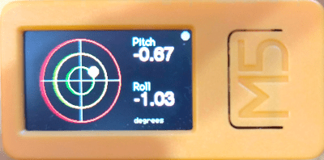
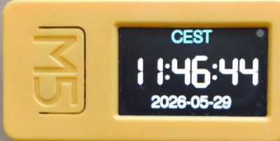
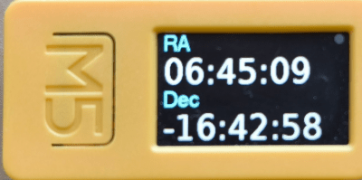
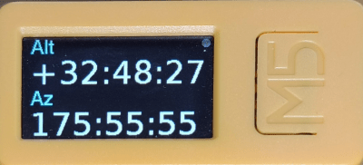
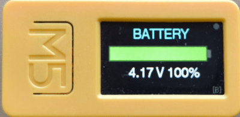
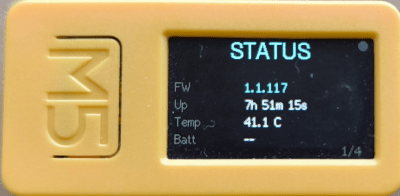
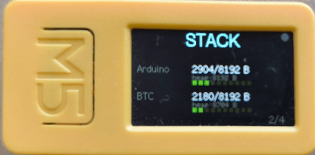
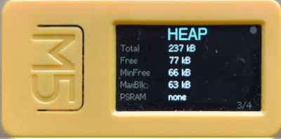
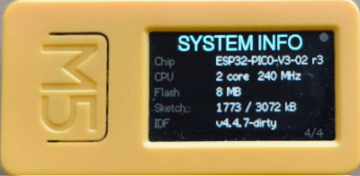
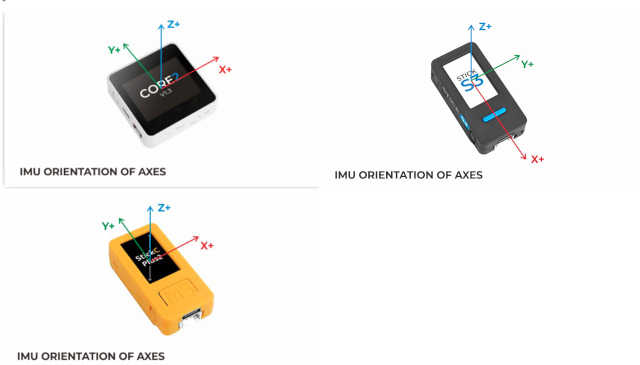

# M5 Bluetooth Clinometer

A BLE-enabled clinometer and telescope status display for M5Stack ESP32 devices (M5StickC Plus 2, M5StickS3, Core2, CoreS3, Grey). Used to align a NexStar Alt/Az GoTo telescope mount and display live coordinates sent from a Raspberry Pi.



















## What it does

- Shows a live **bubble level** (clinometer) based on the built-in IMU — used to level the telescope mount
- Displays live **time** (HH:MM:SS) with configurable timezone — any UTC offset with a custom display label (including multi-word and Unicode names such as `東京標準時間`), or **sidereal time** mode (LST or GST) computed continuously from UTC and observer longitude
- Displays **RA/Dec** and **Alt/Az** coordinates pushed from the Raspberry Pi over BLE
- Exposes a **BLE GATT service** so a Raspberry Pi can query tilt angles and update the displayed data at any time, regardless of which screen is active
- Supports **operator messages** — the Pi can push short text to the display, optionally waiting for a button acknowledgement
- Supports **night mode** — switches all display colours to red/orange-red to preserve dark-adapted vision at the eyepiece
- **Configurable pitch and roll axes** — each angle can be assigned to any signed UX axis (`+X`, `-X`, `+Y`, `-Y`) via `SET_PITCHROLL`, so the clinometer reads correctly regardless of how the device is physically oriented or mounted; the bubble level position always tracks the true physical level independently of the axis assignment
- **Persists settings across power cycles** — the RTC always stores true UTC and is restored automatically on every boot. The timezone label, UTC offset, observer longitude, calibration reference vector, and pitch/roll axis assignment can additionally be saved to on-chip NVM with an explicit `PERSIST` command; on the next boot the device restores all of these without any BLE interaction. `PERSIST CLEAR` invalidates stored settings with a single flash write; `PERSIST RESTORE` re-applies stored settings to the running device without a reboot. On devices without an onboard RTC (e.g. M5Stack Grey) the clock is not preserved across power cycles; `SET_TIME` must be re-sent after each reboot
- **Auto-dim** — the backlight drops to a low level after 60 seconds of inactivity (no BLE command received and no tilt change exceeding 5°). The autodim ceiling is 128 (out of 255); full hardware brightness (255) is available by setting brightness manually. Autodim resumes immediately on the next BLE command or when the device is moved beyond the threshold. When tilt streaming is active the display is always kept at the autodim ceiling. Night mode overrides autodim with its own fixed dim level. The `SET_BRIGHT` command sets a fixed level (0–255) that suspends autodim entirely; `SET_BRIGHT AUTO` re-enables it. A long-press (≥ 1 s) of the front button cycles through five presets — four fixed levels and **auto** — playing a distinct tone at each step (higher pitch = brighter; auto plays a double-beep). Continuing past the lowest level returns directly to auto without needing a BLE command

## Hardware

| Item | Detail |
|---|---|
| Reference device | M5StickC Plus 2 |
| MCU | ESP32 |
| Display | ST7789 135×240 LCD (landscape: 240×135); layout adapts to other resolutions |
| IMU | MPU6886 6-axis accelerometer/gyroscope |
| PMIC | AXP2101 (battery management) |
| Communication | Bluetooth Low Energy (BLE 4.2) |

### Known limitations

- **Battery voltage with ENV III attached** — On the M5StickC Plus 2, connecting an ENV III Unit via the Grove port causes `M5.Power.getBatteryVoltage()` (M5Unified) to return a fixed ~6.30 V instead of the true ~4.25 V. This is an upstream M5Unified library bug. The firmware discards the reading and shows `-- V` on the Battery screen; the battery percentage bar (derived from `getBatteryLevel()`) is unaffected. The issue does not occur on M5StickS3, Core2, or Grey.

## Installing from a pre-built release

Pre-built firmware binaries for the **M5StickC Plus 2** are attached to every [GitHub Release](../../releases). Download the file named `firmware-vX.Y.Z-m5stickc-plus2.bin` and flash it with one of the methods below. No toolchain or build environment is required.

For all other supported boards (Core2, CoreS3, Grey) build from source — see [Building](#building).

### Method 1 — ESP Web Flasher (no install required)

Works in **Chrome or Edge** on Windows, macOS, and Linux (requires the browser to support WebSerial).

1. Connect the M5StickC Plus 2 to your computer via USB.
2. Open [https://espressif.github.io/esptool-js/](https://espressif.github.io/esptool-js/) in Chrome or Edge.
3. Click **Connect**, select the device's serial port, and click **Connect** again.
4. Under **Flash Address**, enter `0x0000`.
5. Click **Choose File** and select the downloaded `.bin`.
6. Click **Program** and wait for the progress bar to complete (~30 seconds).
7. Press the reset button on the device (or power-cycle it). The clinometer screen appears.

### Method 2 — M5Burner (M5Stack GUI tool)

[M5Burner](https://docs.m5stack.com/en/download) is M5Stack's official desktop flashing tool. It runs on Windows, macOS, and Linux.

1. Install and open M5Burner.
2. Click **…** (browse) in the top-right and select the downloaded `.bin`.
3. Select the correct COM/serial port and set baud rate to **921600**.
4. Click **Burn** and wait for the flash to complete.
5. The device resets automatically when done.

### Method 3 — esptool (command line)

If you have Python installed, `esptool` can be used directly.

```bash
pip install esptool
python -m esptool --chip esp32 --port /dev/ttyUSB0 --baud 921600 \
    write_flash 0x0000 firmware-vX.Y.Z-m5stickc-plus2.bin
```

Replace `/dev/ttyUSB0` with the correct port (`COMx` on Windows, `/dev/cu.usbserial-*` on macOS).

---

## Building

This is a [PlatformIO](https://platformio.org/) project targeting the Arduino framework. Use the `flash` script to build and upload in one step:

```bash
./flash                  # build + flash to m5stickc-plus2 (default)
./flash m5stickc-plus2
./flash mstickS3
./flash m5stack-core2
./flash m5stack-grey
./flash m5stack-cores3
./flash -h               # show usage
```

Compilation is incremental — only changed files are recompiled. The script replaces the old separate `build` and `deploy` scripts.

### Supported board environments

| Environment | Board | Platform |
|---|---|---|
| `m5stickc-plus2` | M5StickC Plus 2 | espressif32 @ 7.x |
| `mstickS3` | M5StickS3 | espressif32 @ 7.x |
| `m5stack-core2` | M5Stack Core2 | espressif32 @ 7.x |
| `m5stack-grey` | M5Stack Grey | espressif32 @ 7.x |
| `m5stack-cores3` | M5Stack CoreS3 | espressif32 @ 7.x |

The source uses **M5Unified** (`m5stack/M5Unified`) rather than the device-specific `M5StickCPlus2` library. `M5.Imu.isEnabled()` and `M5.Speaker.isEnabled()` guards are used throughout so the firmware degrades gracefully on boards that lack an IMU or speaker — the clinometer screen shows `IMU N/A` and BEEP commands are silently skipped. The display layout adapts to the actual screen dimensions reported by `M5.Display` after `setRotation()`: all pixel coordinates, margins, bar sizes, and bubble radii are derived from `width()` and `height()` at start-up, so the same code renders correctly on the M5StickC Plus 2 (240×135) and on larger displays such as the Core2 or CoreS3 (320×240).

### CoreS3 note

CoreS3 uses ESP32-S3, which requires `espressif32@7.x`. PlatformIO downloads it automatically on first build for that environment. You also need `intelhex` in PlatformIO's own virtualenv:

```bash
~/.platformio/penv/bin/pip install intelhex
```

### Developer setup (git hooks)

After cloning, run the install script once to activate the pre-commit hook that
auto-stamps the build number in `src/version.h`:

```bash
./scripts/install-hooks
```

The hook increments `FW_VERSION` from `"MAJOR.MINOR"` to `"MAJOR.MINOR.NNN"` on
every commit, where NNN is the total commit count. It is safe to re-run.

#### Version numbering

- **Odd minor** (e.g. `1.3`) — development branch. The patch number is the
  running total commit count, auto-stamped by the hook on every commit. It does
  not reset when the minor version changes, but does reset to 0 when the major
  version changes.
- **Even minor** (e.g. `1.2`) — release branch. The hook is skipped; the patch
  number is set manually and incremented only for bug-fix releases.

## Screens

The **M5 front button** cycles through screens in order:

| # | Screen | Description |
|---|---|---|
| 0 | Clinometer | Bubble level with 1°/2°/3° rings, numeric Pitch/Roll readout |
| 1 | Time | Current time HH:MM:SS; timezone/LST label centered in cyan at the top (if set). Solar: date below the digits. Sidereal: no date. |
| 2 | RA/Dec | Right Ascension and Declination from the telescope |
| 3 | Alt/Az | Altitude and Azimuth from the telescope |
| 4 | Battery | Charge bar with colour coding, voltage (V) and level (%); `[B]` nav icon at bottom-right |
| — | Message | Temporary full-screen overlay triggered by BLE command |

### System Info pages

A short press of the **side button (BtnB)** from the Battery screen enters a set of read-only diagnostic pages. These are not part of the front-button cycle. Repeated short presses advance through the pages and wrap back to Battery.

| Page | Content |
|---|---|
| 1/4 — STATUS | Firmware version · uptime · IMU die temperature (°C) · battery charging state (CHG/DSG from PMIC; `--` on boards without a PMIC) |
| 2/4 — STACK | Loop-task and BTC-task stack high-water marks: peak-used / total bytes with colour-coded 10-segment bar each. Between the text line and the bar, a small `heap: N B` annotation shows the actual heap block size allocated for the task stack (`heap_caps_get_allocated_size`), which is always slightly larger than the configured size due to TLSF allocator block rounding. For the BTC task this is a runtime sanity check: the bar denominator is `CONFIG_BT_BTC_TASK_STACK_SIZE`, but that task's stack is precompiled into `libbt.a` and cannot be changed by redefining the macro — if the two values diverge significantly, the config is misleading. BTC row only shown on builds where `CONFIG_BT_BTC_TASK_STACK_SIZE` is defined. |
| 3/4 — HEAP | Heap: total · free · min-free watermark · max-alloc block · PSRAM free (or `none`) |
| 4/4 — SYSTEM INFO | Chip model and revision · core count and CPU frequency · flash size · sketch used/free · IDF SDK version |

Pressing the front button from any System Info page advances to the Clinometer screen, the same as pressing it from Battery.

### Status indicators

Two persistent indicators appear on every screen:

- **BLE dot** (top-right corner) — green when a central is connected, dark when not.
- **Battery bar** (bottom-left of the clinometer screen) — a slim horizontal bar of up to 9 segments shows the charge level; each segment lights up for every 10% above 0%. The bar is dark green at 40% or above, dark amber at 20–39%, and dark red below 20%. In night mode all colours shift to red to preserve dark-adapted vision.
## Button behaviour

| Button | Short press | Long press |
|---|---|---|
| M5 (front) | Cycle to next screen (Clinometer→Time→RA/Dec→Alt/Az→Battery→…); from a System Info page: advance to Clinometer | **≥ 1 s:** step through brightness presets `255 → 128 → 32 → 1 → auto → 255 → …`, playing a tone at each step (see [`SET_BRIGHT`](#set_bright)) |
| Top (side) | **Battery or System Info page:** advance to next System Info page (wraps back to Battery after page 4); **any other screen:** reboot | **≥ 2 s:** power off |

When a `SHOW_MSG_WAIT` message is active, pressing the M5 button (if it is in the watch list) sends a `EVENT BUTTON M5` notification over BLE instead of cycling screens.

---

## BLE Interface

### Connection parameters

| Parameter | Value |
|---|---|
| Device name | `M5-NexStar-Level` |
| Role | Peripheral / GATT server |
| MTU | 185 bytes (requested) |
| Default mode | Request / reply (no streaming unless enabled) |

The device advertises continuously. After a central disconnects, advertising restarts automatically.

### GATT service

**Service UUID:** `7d91b000-8f3b-4b63-b6a4-5d1e6b7a1000`

| Characteristic | UUID | Properties | Purpose |
|---|---|---|---|
| Command | `7d91b001-8f3b-4b63-b6a4-5d1e6b7a1000` | Write, Write Without Response | Pi → device: send a command |
| Response | `7d91b002-8f3b-4b63-b6a4-5d1e6b7a1000` | Read, Notify | Device → Pi: command replies and async events |
| Status | `7d91b003-8f3b-4b63-b6a4-5d1e6b7a1000` | Read | Compact device state snapshot (polled, no notify) |

### Protocol

Commands and responses are **ASCII text**, one per write/notify. Fields are space-separated.

**Newline framing (optional):** If a client sends commands that end with `\n` (or `\r\n`), the device detects this on the first such command and appends `\n` to every subsequent reply and async notification for that connection. This makes the stream appear as newline-delimited text to clients that treat BLE as a byte stream. Clients that send commands without a trailing `\n` receive plain responses with no terminator. The flag is sticky for the lifetime of a connection and resets on disconnect.

**Input sanitisation:** Before tokenising each command write the device normalises two common non-ASCII space variants to ASCII space: NBSP (U+00A0, `C2 A0`) and ideographic space (U+3000, `E3 80 80`). Commands pasted from iOS/Android keyboards or copy-pasted text that contains these variants therefore parse correctly without client-side workarounds. If the write contains any other ASCII control character (byte value `< 0x20` or `0x7F`) after the trailing-whitespace strip, the write is rejected immediately with `ERR INVALID_CHAR U+XXXX` where `XXXX` is the hex code point of the first offending byte.

Subscribe to notifications on the **Response** characteristic to receive replies and asynchronous events (button presses, screen changes). The device sends one notify per command reply.

---

## BLE Commands

### `HELP`

Returns a concise list of all accepted commands. The device sends one notify packet per command line. `HELP` is always the last packet and serves as the stream terminator — no separate `OK` is sent.

```
→ HELP
← PING
← GET_TILT
← CALIBRATE [gx gy gz]
← CALIBRATE_RESET
← GET_STATUS
← GET_TIME
← GET_RADEC
← GET_ALTAZ
← GET_MSG
← SET_TIME <ISO8601+offset> [<label>]
← SET_TIME_ZONE <+HH:MM|-HH:MM|UTC|LST> [label]
← SET_LONGITUDE <degrees|NONE>
← SET_RADEC <ra> <dec>
← SET_ALTAZ <alt> <az>
← SHOW_MSG <dur> [FONT:<n>] [BEEP] <text...>
← SHOW_MSG_WAIT <dur> <btns> [FONT:<n>] [BEEP] <text...>
← CANCEL_MSG
← START_STREAM <ms>
← STOP_STREAM
← SET_NIGHT_MODE ON|OFF
← SET_BRIGHT <0-255>|AUTO
← GET_PITCHROLL
← SET_PITCHROLL <pitch>,<roll>  axes: +X|-X|+Y|-Y
← BEEP [<notes...>]
← SET_SCREEN CLINOMETER|TIME|RADEC|ALTAZ|BATTERY|SYSINFO-1..4
← PERSIST [CLEAR|RESTORE|READ]
← REBOOT
← HELP
```

Clients should subscribe to notifications and collect packets until they receive `HELP`. `?` is accepted as a synonym.

---

### `PING`

Returns a liveness acknowledgement.

```
→ PING
← OK PONG
```

---

### `GET_TILT`

Returns the current **pitch**, **roll**, and **gravity magnitude** in decimal degrees and g respectively.

```
→ GET_TILT
← TILT +0.42 -1.17 1.00
```

The first value is **pitch** (tilting the screen toward or away from you — rotation around the device's long axis), the second is **roll** (side tilt — rotation around the short axis), and the third is the **gravity vector magnitude in g**. Both angles are computed from all three raw accelerometer components using `atan2` with a cross-axis magnitude denominator, so they cover the full ±180° range without wrapping or clamping and remain stable when both axes are simultaneously tilted. The g value is ~1.00 when the device is stationary; it rises when the device is accelerating or vibrating, which signals that the current pitch/roll reading may be noisy.

**Angle convention** — the clinometer reports user-facing angles, not raw IMU Euler values. For every supported device the firmware first defines a screen-aligned UX frame:

```
UX +X = screen right
UX +Y = screen up
UX +Z = out of the screen, toward the viewer
```

Pitch and roll are then defined as **signed rotations about UX axes**. The defaults are:

```
pitch = + rotation about UX +X   (axis code +X)
roll  = + rotation about UX +Y   (axis code +Y)
```

Both axes follow the standard right-hand rule: for +X, positive pitch means the top of the screen tilts toward the viewer; for +Y, positive roll means the right side of the screen tilts toward the viewer.

These defaults can be changed with `SET_PITCHROLL` and persisted with `PERSIST` — see the [`GET_PITCHROLL` / `SET_PITCHROLL`](#get_pitchroll) section below.



```
Device lying flat, screen facing up — UX frame as seen from above:

          screen up
             ↑  UX +Y
             |
             |
  UX +X ─────┼─────→  screen right
             |
             |
          (UX +Z points out of the screen, toward you)
```

See [`docs/adr/0002-angle-convention.md`](docs/adr/0002-angle-convention.md) for full per-device IMU-to-UX mappings.

**Axis mapping** is device-dependent and handled automatically at runtime via `M5.getBoard()`. The same UX-frame convention applies to all supported devices; only the internal IMU-to-UX remapping differs:

| Device family | UX +X direction in IMU | UX +Y direction in IMU |
|---|---|---|
| M5StickC Plus / Plus2 (landscape) | IMU +Y | IMU −X |
| M5StickS3 (landscape) | IMU −X | IMU −Y |
| Core2, CoreS3, Grey, others | IMU +X | IMU +Y |

After remapping, pitch and roll are computed identically for all devices using the configured axis codes.

When a `CALIBRATE` offset is active, these are in the **calibrated frame of reference** — the origin of pitch = 0, roll = 0 is the stored reference orientation, not the hardware default. `CALIBRATE_RESET` returns to the hardware frame (device flat and face-up).

**Upside-down behaviour:** when the device is perfectly inverted and level (pitch/roll near ±180°) both values approach ±180°, correctly indicating that it is level but face-down. The on-screen bubble uses `sin(angle)` for its position so it smoothly re-centres at ±180° — the bubble sits at the centre of the circle whether the device is face-up or face-down level. The numeric display and this response always show the true angle.

Values update at ~15 Hz internally; the response reflects the most recent filtered sample.

#### Reconstructing the UX gravity vector from pitch and roll

Given a `TILT p r g` response (angles in degrees, `g` in g units), the three components of the gravity vector in the UX frame can be recovered. The UX axes are screen right (+X), screen up (+Y), and out of the screen toward the viewer (+Z).

Convert the angles to radians:

```
p = pitch_deg × π/180
r = roll_deg  × π/180
```

**guz** (the screen-normal component) is the same for every `SET_PITCHROLL` configuration:

```
s   = +1  if both |pitch_deg| ≤ 90° and |roll_deg| ≤ 90°, else −1
guz = s · g · √(max(0, 1 − sin²(p) − sin²(r)))
```

`guz` is positive when the screen faces away from the floor and negative when face-down. `s` reflects whether the device is past vertical: the firmware's cross-axis atan2 formula propagates the sign of guz into the reported angles (values outside ±90° indicate guz < 0).

**gux and guy** depend on the axis assignment. The cross-axis denominator makes each component simply g times the sine of its angle — no common denominator is needed:

*Pitch is an X-type axis, roll is a Y-type axis:*

| Pitch | Roll | gux         | guy         |
|-------|------|-------------|-------------|
| `+X`  | `+Y` | −g · sin(r) | +g · sin(p) |
| `+X`  | `−Y` | +g · sin(r) | +g · sin(p) |
| `−X`  | `+Y` | −g · sin(r) | −g · sin(p) |
| `−X`  | `−Y` | +g · sin(r) | −g · sin(p) |

*Pitch is a Y-type axis, roll is an X-type axis:*

| Pitch | Roll | gux         | guy         |
|-------|------|-------------|-------------|
| `+Y`  | `+X` | −g · sin(p) | +g · sin(r) |
| `+Y`  | `−X` | −g · sin(p) | −g · sin(r) |
| `−Y`  | `+X` | +g · sin(p) | +g · sin(r) |
| `−Y`  | `−X` | +g · sin(p) | −g · sin(r) |

**Default configuration** (`SET_PITCHROLL +X,+Y`):

```python
import math
p, r = math.radians(pitch_deg), math.radians(roll_deg)
s   = 1.0 if (abs(pitch_deg) <= 90.0 and abs(roll_deg) <= 90.0) else -1.0
guz =  s * g * math.sqrt(max(0.0, 1.0 - math.sin(p)**2 - math.sin(r)**2))  # screen normal (+Z)
guy =  g * math.sin(p)                                                        # screen up    (+Y)
gux = -g * math.sin(r)                                                        # screen right (+X)
```

**Verification:** `√(gux² + guy² + guz²)` should equal `g`. When calibration is active the angles are in the calibrated frame but the magnitude is unchanged.

**Degenerate case:** reconstruction is undefined only when `g = 0` (free fall). Check `g > ε` before computing.

---

### `CALIBRATE [gx gy gz]`

Without arguments, stores the current orientation as the pitch = 0, roll = 0 reference and returns the normalised reference gravity vector that encodes it:

```
→ CALIBRATE
← CALIBRATED +0.0023 -0.0150 +0.9999
```

With three arguments, restores a previously saved reference vector directly — no need for the device to be in the calibrated orientation:

```
→ CALIBRATE +0.0023 -0.0150 +0.9999
← CALIBRATED +0.0023 -0.0150 +0.9999
```

Both forms return the same `CALIBRATED gx gy gz` format. The calibration is held in RAM and is cleared on reboot. To survive a power cycle, either:

- Send `PERSIST` after calibrating — the device restores the calibration automatically on the next boot, or
- Record the three numbers from the response and send `CALIBRATE <gx> <gy> <gz>` after each reboot to restore manually.

Calibration is implemented as a 3×3 Rodrigues rotation matrix applied to the raw accelerometer vector before angle extraction. It works correctly for any starting orientation — not just small corrections.

---

### `CALIBRATE_RESET`

Removes the calibration and restores the hardware reference (device flat and face-up = 0°, 0°).

```
→ CALIBRATE_RESET
← OK CALIBRATION_RESET
```

---

### `GET_STATUS`

Returns a one-line summary of device state.

```
→ GET_STATUS
← STATUS SCREEN=CLINOMETER BLE=1 STREAM=0 BAT=3.96 NIGHT=0 BRIGHT=AUTO FW=1.2
```

| Field | Values | Description |
|---|---|---|
| `SCREEN` | `CLINOMETER` `TIME` `RADEC` `ALTAZ` `BATTERY` `MESSAGE` `SYSINFO-1` `SYSINFO-2` `SYSINFO-3` `SYSINFO-4` | Active screen |
| `BLE` | `0` `1` | BLE connected flag |
| `STREAM` | `0` `1` | Tilt streaming enabled |
| `BAT` | float volts | Battery voltage (AXP2101) |
| `NIGHT` | `0` `1` | Night mode enabled |
| `BRIGHT` | `AUTO` or `0`–`255` | `AUTO` = autodim active; numeric = manually fixed brightness level |

---

### `GET_TIME`

Returns the current time, ticking locally since the last `SET_TIME`.

The response format depends on the active mode:

| Mode | Example response |
|---|---|
| Solar, no time set | `TIME NONE` |
| Solar | `TIME 2026-04-19T18:42:10Z` |
| Sidereal, longitude configured | `TIME 18:42:10 LST` |
| Sidereal, no longitude | `TIME 18:42:10 GST` |

```
→ GET_TIME
← TIME 2026-04-19T18:42:10Z       (solar — always UTC with Z suffix)
← TIME 18:42:10 LST               (sidereal with longitude — no date)
← TIME 18:42:10 GST               (sidereal without longitude — no date)
← TIME NONE                       (no time set yet)
```

Solar mode **always returns UTC with a `Z` suffix**. The device never returns local time from this command; the client applies its own UTC offset for display purposes. Use `SET_TIME_ZONE` to configure the local offset for the on-device TIME screen.

In sidereal mode the date is omitted. The label is `LST` (Local Sidereal Time) when an observer longitude has been configured via `SET_LONGITUDE`, or `GST` (Greenwich Sidereal Time) when no longitude has been set.

Returns `TIME NONE` if no time has been set since boot.

---

### `GET_RADEC`

Returns the stored RA/Dec strings.

```
→ GET_RADEC
← RADEC 12:34:56 +07:08:09
```

Returns `--:--:--` placeholders until set by `SET_RADEC`.

---

### `GET_ALTAZ`

Returns the stored Alt/Az strings.

```
→ GET_ALTAZ
← ALTAZ +43.2 181.7
```

Returns `---` placeholders until set by `SET_ALTAZ`.

---

### `GET_MSG`

Returns the current message state.

```
→ GET_MSG
← MSG NONE

← MSG ACTIVE INF FONT=5 BUTTONS=M5 TEXT=Press M5 to continue
← MSG ACTIVE 4 FONT=0 BUTTONS=NONE TEXT=Moving altitude axis
```

The second field is the remaining lifetime in seconds, or `INF` for a persistent message. `FONT=<n>` is the active font code (see the font code table under `SHOW_MSG`); code 0 is the default `Font4`.

---

### `SET_TIME <iso8601> [<label>]`

Sets the device clock to the given UTC time and switches to solar mode. The device ticks locally from this point.

```
→ SET_TIME 2026-05-14T12:30:00Z
← OK TIME

→ SET_TIME 2026-05-14T12:30:00+01:00
← OK TIME

→ SET_TIME 2026-05-14T12:30:00 CET
← OK TIME

→ SET_TIME 2026-05-14T12:30:00-05:00 New York
← OK TIME

→ SET_TIME 2026-05-14T12:30:00 東京標準時間
← OK TIME

← ERR BAD_TIME
```

The datetime is always `YYYY-MM-DDTHH:MM:SS`. A `+HH:MM` / `-HH:MM` offset suffix is **parsed and subtracted**, so the device stores true UTC — for example, `2026-05-14T12:30:00+01:00` stores `11:30:00 UTC`. Everything after the datetime on the command line is used as the label, verbatim including any internal spaces, so multi-word timezone names such as `New York` are supported. The label is for display purposes only and does not affect the stored UTC time. The label may be any UTF-8 string up to 31 bytes, including multi-byte scripts such as Japanese (`東京標準時間`).

The UTC time is written to the hardware RTC (PCF8563). On the next power-on the device reads the RTC and rebuilds the running clock automatically. The timezone label and UTC offset are not stored in the RTC; use `PERSIST` to save them to NVM.

On devices without an onboard RTC (e.g. **M5Stack Grey**) the RTC write is silently skipped. The clock still ticks correctly for the rest of the session — `GET_TIME` returns the correct time and the TIME screen advances normally — but the time anchor is not preserved across power cycles. After each reboot `SET_TIME` must be re-sent.

| Suffix | UTC stored | Label default | Example |
|---|---|---|---|
| `Z` | Datetime as-is | `UTC` | `2026-05-14T12:30:00Z` |
| `+HH:MM` / `-HH:MM` | Offset subtracted | offset string | `2026-05-14T12:30:00+01:00` |
| separate label | Datetime as-is | label (spaces preserved) | `2026-05-14T12:30:00 New York` |
| (none) | Datetime as-is | nothing | `2026-05-14T12:30:00` |

No DST logic is applied. To change the display timezone after setting the time, use `SET_TIME_ZONE` — there is no need to re-send `SET_TIME`.

---

### `SET_TIME_ZONE <spec> [<label>]`

Sets the display timezone or switches to sidereal mode. Does not alter the stored UTC time.

```
→ SET_TIME_ZONE +09:00
← OK TIMEZONE

→ SET_TIME_ZONE +09:00 JST
← OK TIMEZONE

→ SET_TIME_ZONE +09:00 東京標準時間
← OK TIMEZONE

→ SET_TIME_ZONE +09:00 東京 (標準時)
← OK TIMEZONE

→ SET_TIME_ZONE UTC
← OK TIMEZONE

→ SET_TIME_ZONE LST
← OK TIMEZONE

→ SET_TIME_ZONE +bad
← ERR BAD_TZ

← ERR BAD_ARGS
```

| `<spec>` | Effect |
|---|---|
| `+HH:MM` / `-HH:MM` | Solar mode; sets UTC offset in seconds; label defaults to the offset string |
| `UTC` | Solar mode; UTC offset = 0; label `UTC` |
| `LST` | Sidereal mode; label is `LST` if a longitude is configured, else `GST` |

Everything after `<spec>` on the command line overrides the display label shown in the top-left of the TIME screen, verbatim including any internal spaces — so `SET_TIME_ZONE +09:00 JST` shows `JST` and `SET_TIME_ZONE +09:00 東京 (標準時)` shows `東京 (標準時)`. The label may be any UTF-8 string up to 31 bytes, including multi-byte scripts such as Japanese. The label is informational only; the UTC offset is what drives the clock arithmetic.

Timezone changes take effect immediately for the TIME screen and `GET_TIME`. Use `PERSIST` to save the setting across reboots.

---

### `SET_LONGITUDE <degrees|NONE>`

Sets the observer longitude used for Local Sidereal Time computation, or clears it.

```
→ SET_LONGITUDE 135.5
← OK LONGITUDE

→ SET_LONGITUDE -3.7
← OK LONGITUDE

→ SET_LONGITUDE NONE
← OK LONGITUDE

← ERR BAD_ARGS   (out of ±180° range or non-numeric)
```

Degrees east of Greenwich; negative for west. Valid range is −180.0 to +180.0. Once set, `GET_TIME` in sidereal mode returns `HH:MM:SS LST` instead of `GST`, and the TIME screen label switches accordingly. `NONE` clears the longitude (reverts to GST mode if sidereal is active).

Use `PERSIST` to save the longitude across reboots.

---

### `SET_RADEC <ra> <dec>`

Updates the RA/Dec values shown on the RA/Dec screen.

```
→ SET_RADEC 12:34:56 +07:08:09
← OK RADEC
← ERR BAD_ARGS
```

RA is `HH:MM:SS`. Dec is `+/-DD:MM:SS`. Values are stored as display strings; no range validation is performed.

---

### `SET_ALTAZ <alt> <az>`

Updates the Alt/Az values shown on the Alt/Az screen.

```
→ SET_ALTAZ +43.2 181.7
← OK ALTAZ
← ERR BAD_ARGS
```

Both values are decimal degrees. Values are stored as display strings.

---

### `SHOW_MSG <duration> [FONT:<n>] [BEEP] <text>`

Displays a message on the full-screen message overlay.

```
→ SHOW_MSG 5 Moving altitude axis
→ SHOW_MSG INF Waiting for solar centering
→ SHOW_MSG 10 FONT:5 Slewing to α Centauri
→ SHOW_MSG 3 BEEP Alignment complete
→ SHOW_MSG INF FONT:6 BEEP ¡Atención!
← OK MSG
← ERR BAD_ARGS
```

| `<duration>` | Meaning |
|---|---|
| Integer (seconds) | Message auto-dismisses after this many seconds |
| `INF` | Message persists until `CANCEL_MSG` or a replacement |

The device switches to the message screen immediately and returns to the previous screen when the message expires or is cancelled. BLE and IMU continue running in the background.

`FONT:<n>` and `BEEP` are optional tokens parsed from the front of the text field; once a token does not match either keyword, all remaining text (including that token) becomes the message body. This means the message body itself must not begin with `FONT:` or the word `BEEP` unless those are intended to be consumed as options.

`BEEP` triggers an immediate short attention tone (880 Hz, 200 ms) when the message appears. For a custom melody, send a separate `BEEP` command before or after `SHOW_MSG`.

#### Font codes

| Code | Font | Approx. height | Character coverage |
|------|------|----------------|--------------------|
| 1 | `Font2` (Bodmer BMPfont) | 16 px | ASCII 0x20–0x7E only |
| 2 | `Font4` (Bodmer BMPfont) — **default** | 26 px | ASCII 0x20–0x7E only |
| 3 | `DejaVu18` (Adafruit GFX) | ~18 px | ASCII 0x20–0x7E only |
| 4 | `DejaVu24` (Adafruit GFX) | ~24 px | ASCII 0x20–0x7E only |
| 5 | `lgfxJapanGothic_16` (U8g2) | 16 px | Full Unicode incl. Latin-1 extended (é, ü, ñ …) |
| 6 | `lgfxJapanGothic_24` (U8g2) | 24 px | Full Unicode incl. Latin-1 extended (é, ü, ñ …) |

Fonts 1–4 are bitmap or proportional sans-serif fonts that cover standard ASCII printable characters only. Accented letters, currency symbols (€, £), and other characters above U+007E will not render with those fonts — use code 5 or 6 instead. `lgfxJapanGothic` is a U8g2 Unicode font that also handles CJK characters.

The default (no `FONT:` token, or `FONT:0` / `FONT:2`) is `Font4`, which is noticeably larger than the original `Font2` used before this feature was added.

**Automatic Unicode upgrade:** if the message text contains any non-ASCII byte (≥ 0x80) and no `FONT:` token was supplied, the device automatically selects `lgfxJapanGothic_24` (code 6, 24 px) to closely match the default Font4 (26 px) visual size while supporting the full Unicode character set. An explicit `FONT:` directive is always honoured as-is and disables the upgrade. The active font code is visible in the `GET_MSG` response as `FONT=<n>`.

**Text wrapping:** the message text is automatically wrapped to fit the display width. The device breaks at word boundaries (spaces) where possible. When a single word is too wide to fit on one line — as is common in languages that do not use spaces, such as Japanese — the device falls back to character-level splitting. All UTF-8 multi-byte sequences are kept intact; no code point is split across lines. This means long Japanese strings such as `今日も小さな幸せがたくさん見つかりますように` and long ASCII tokens without spaces (such as URLs) wrap across multiple lines rather than being clipped.

---

### `SHOW_MSG_WAIT <duration> <buttons> [FONT:<n>] [BEEP] <text>`

Displays a message and registers interest in one or more button presses. When a watched button is pressed, the device sends an `EVENT BUTTON <x>` notification.

```
→ SHOW_MSG_WAIT 30 M5 Press M5 when ready
→ SHOW_MSG_WAIT INF M5,A Confirm or abort
→ SHOW_MSG_WAIT 15 ANY Press any button to stop
→ SHOW_MSG_WAIT INF M5 FONT:5 BEEP ¿Continuar?
← OK MSG_WAIT
← ERR BAD_ARGS
```

**Button mask values:**

| Value | Meaning |
|---|---|
| `M5` | Front M5 button |
| `A` | Top side button |
| `B` | Power/third button |
| `M5,A` | Comma-separated combination |
| `ANY` | Any of the three buttons |

`FONT:<n>` and `BEEP` work identically to `SHOW_MSG` — see the font code table above. The message remains visible after a button press until its timeout expires or `CANCEL_MSG` is received. Multiple button events can be generated if the user presses the button more than once.

---

### `CANCEL_MSG`

Dismisses the active message immediately and returns to the previous screen.

```
→ CANCEL_MSG
← OK MSG_CANCEL
```

Has no effect if no message is active (still returns `OK MSG_CANCEL`).

---

### `START_STREAM <period_ms>`

Enables periodic tilt notifications on the Response characteristic. The device sends a `TILT` line every `<period_ms>` milliseconds without waiting for a request.

```
→ START_STREAM 500
← OK STREAM 500
```

Minimum period is 100 ms. Streaming continues until `STOP_STREAM` or disconnection. Because streaming is tied to a connection, `START_STREAM` and the notification subscriber must be on the **same BLE connection** — use `m5ctl listen --stream <ms>` rather than separate `stream` and `listen` calls.

---

### `STOP_STREAM`

Disables tilt streaming.

```
→ STOP_STREAM
← OK STREAM 0
```

---

### `SET_NIGHT_MODE <on|off>`

Switches the display into night mode (or back to normal). In night mode all display colours are shifted to the red family to preserve dark-adapted vision at the telescope eyepiece. Elements that were previously green (1° clinometer ring, battery-good fill, BLE-connected indicator) are rendered in a warm orange-red to retain visual hierarchy; all other non-black colours use pure red.

```
→ SET_NIGHT_MODE ON
← OK NIGHT_MODE ON

→ SET_NIGHT_MODE OFF
← OK NIGHT_MODE OFF

← ERR BAD_ARGS   (if argument is missing or not ON/OFF)
```

Night mode persists until explicitly disabled or the device reboots. The current state is reported by `GET_STATUS` as `NIGHT=1` / `NIGHT=0`.

---

### `SET_BRIGHT <0-255|AUTO>`

Sets a fixed backlight level or re-enables the autodim system.

```
→ SET_BRIGHT 255
← OK BRIGHT 255

→ SET_BRIGHT 32
← OK BRIGHT 32

→ SET_BRIGHT AUTO
← OK BRIGHT AUTO

← ERR BAD_ARGS   (if argument is missing, non-numeric and not AUTO, or out of 0–255 range)
```

When a numeric level is given the autodim system is suspended and the backlight is held at that exact level. The autodim ceiling when active is 128; `SET_BRIGHT 255` therefore exceeds what autodim would ever set on its own. `SET_BRIGHT AUTO` resumes autodim. Night mode is overridden by a subsequent `SET_BRIGHT`. The current state is reported by `GET_STATUS` as `BRIGHT=AUTO` or `BRIGHT=<n>`.

The front button (BtnA) long-press (≥ 1 s) also cycles through five presets — `255 → 128 → 32 → 1 → auto → 255 → …` — playing a different tone at each step: higher pitch for higher brightness (A6 → E6 → A5 → A4), and a distinctive double-beep when the cycle wraps back to auto. Reaching the `auto` step re-enables autodim, so BLE is not needed to return to automatic brightness control.

---

### `GET_PITCHROLL` {#get_pitchroll}

Returns the current pitch and roll axis assignment.

```
→ GET_PITCHROLL
← PITCHROLL +X,+Y
```

The response is always `PITCHROLL <pitch>,<roll>` where each axis is one of `+X`, `-X`, `+Y`, or `-Y`. The default after boot (or after `PERSIST CLEAR`) is `+X,+Y`.

---

### `SET_PITCHROLL <pitch>,<roll>`

Assigns a signed UX axis to pitch and roll. The argument is a comma-separated pair of axis codes with no spaces.

```
→ SET_PITCHROLL +X,+Y
← OK PITCHROLL +X,+Y

→ SET_PITCHROLL -X,+Y
← OK PITCHROLL -X,+Y

→ SET_PITCHROLL +X,-Y
← OK PITCHROLL +X,-Y

→ SET_PITCHROLL bad
← ERR BAD_ARGS
```

**Axis codes:**

| Code | Meaning |
|---|---|
| `+X` | + rotation about UX +X (top of screen rises → positive) — default pitch |
| `−X` | − rotation about UX +X (bottom of screen rises → positive) |
| `+Y` | + rotation about UX +Y (right side tilts toward viewer → positive) — default roll |
| `−Y` | − rotation about UX +Y |

Both pitch and roll must be specified; any combination of the four codes is accepted for each position. The assignment takes effect immediately for `GET_TILT` responses, the streaming `TILT` notifications, and the on-screen numeric readout.

The on-screen **bubble level position** is not affected by `SET_PITCHROLL` — the bubble always shows the true physical level in UX screen coordinates. The **crosshair colours** and **double-arrow icons** on the clinometer screen do update:

- When pitch is an X-type axis (`+X`/`-X`) and roll is a Y-type axis (`+Y`/`-Y`): vertical crosshair is cyan (pitch) and horizontal is orange (roll); pitch gets a ↕ icon and roll gets a ↔ icon.
- When the axes are swapped — pitch is Y-type and roll is X-type: the crosshair colours swap (vertical orange, horizontal cyan) and the icons swap (pitch ↔, roll ↕).
- The arrowhead on each crosshair always points toward the screen edge that corresponds to a positive value of the axis assigned to that crosshair.

Use `PERSIST` to save the assignment across reboots.

```
→ ERR BAD_ARGS   (missing roll, unknown code, or no argument)
```

---

### `SET_SCREEN <name>`

Navigates immediately to the named screen. Useful for test automation and integration scripts that need to verify the `GET_STATUS` `SCREEN=` field without physical button presses.

```
→ SET_SCREEN CLINOMETER
← OK SCREEN CLINOMETER

→ SET_SCREEN SYSINFO-2
← OK SCREEN SYSINFO-2

← ERR BAD_ARGS   (unrecognised name)
```

Valid names match the values returned by `GET_STATUS`:

| Name | Screen |
|---|---|
| `CLINOMETER` | Bubble-level screen |
| `TIME` | Date/time screen |
| `RADEC` | RA/Dec screen |
| `ALTAZ` | Alt/Az screen |
| `BATTERY` | Battery screen |
| `SYSINFO-1` | System Info page 1/4 — STATUS |
| `SYSINFO-2` | System Info page 2/4 — STACK |
| `SYSINFO-3` | System Info page 3/4 — HEAP |
| `SYSINFO-4` | System Info page 4/4 — SYSTEM INFO |

`MESSAGE` is not accepted — use `SHOW_MSG` / `SHOW_MSG_WAIT` to enter the message overlay.

---

### `BEEP [note ...]`

Plays a beep or a melody through the built-in speaker. The response is returned immediately while the melody plays asynchronously.

```
→ BEEP
← OK BEEP

→ BEEP C'4 G8 -16 G8 A4 G4 -2 B4 C'4
← OK BEEP

→ BEEP C4 Z4
← ERR BAD_MELODY C4 ^Z4
```

With no arguments the device emits a single short attention beep (880 Hz, 200 ms). With note tokens it plays the sequence as a melody.

**Note token format:** `<letter>[accidental][octave][duration][dot]`

Each token is a space-separated note or rest:

| Part | Syntax | Meaning |
|---|---|---|
| Letter | `A` `B` `C` `D` `E` `F` `G` | Note name (case-insensitive) |
| Rest | `-` | Silence for the given duration |
| Sharp / flat | `#` or `b` after letter | Raise or lower by one semitone |
| Octave up | `'` (one or more) after accidental | Each `'` raises the note by one octave |
| Octave down | `,` (one or more) after accidental | Each `,` lowers the note by one octave |
| Duration | `1` `2` `4` `8` `16` | Whole, half, quarter, eighth, sixteenth; default `4` |
| Dotted | `.` after duration | Multiplies duration by 1.5 |

Bare letter names (no `'` or `,`) are in the middle register. A single `'` shifts up one octave from there; a single `,` shifts down one octave. Multiple marks stack: `C''` is two octaves above the middle C, `C,,` is two below.

**Examples:**

| Token | Meaning |
|---|---|
| `C` | Middle C, quarter note |
| `C'` | One octave above middle C, quarter note |
| `C,` | One octave below middle C, quarter note |
| `G#8` | G sharp, eighth note |
| `Bb2` | B flat, half note |
| `C4.` | Dotted quarter (1.5× duration) |
| `-4` | Quarter-note rest |

"Shave And A Hair Cut":

```
BEEP C'4 G8 -16 G8 A4 G4 -2 B4 C'4
```

Up to 32 notes per command.

---

### `PERSIST [CLEAR|RESTORE|READ]`

Manages non-volatile storage of user settings. Five values can be persisted: the **timezone label**, **UTC offset**, **observer longitude**, **calibration reference vector**, and **pitch/roll axis assignment**. NVM writes happen only on an explicit `PERSIST` command — no write occurs during `SET_TIME`, `SET_TIME_ZONE`, `SET_LONGITUDE`, `CALIBRATE`, `CALIBRATE_RESET`, or `SET_PITCHROLL`.

#### `PERSIST`

Saves the current timezone label, UTC offset, observer longitude, calibration reference vector, and pitch/roll axis assignment to NVM. Data keys are written first; the validity flag is written last so a power loss mid-write leaves NVM in a clean invalid state.

```
→ PERSIST
← OK PERSISTED tz=JST tz_offset=32400 lon=135.5000 cal=+0.0023,-0.0150,+0.9999 pitchroll=+X,+Y
← OK PERSISTED tz=UTC tz_offset=0 lon=(none) cal=+0.0023,-0.0150,+0.9999 pitchroll=+X,+Y
```

On the next power-on the device restores all saved values automatically. The UTC time itself is always recovered from the hardware RTC; sidereal phase is recomputed from UTC + longitude using the GMST formula, so the sidereal clock continues correctly without any stored sidereal state.

#### `PERSIST CLEAR`

Invalidates all stored NVM settings with a **single flash write** (sets an internal validity byte to 0). Data keys are left in flash but ignored on boot. This is the lowest-wear way to clear settings.

```
→ PERSIST CLEAR
← OK CLEARED
```

#### `PERSIST RESTORE`

Re-enables the stored NVM settings (sets the validity byte back to 1) and immediately applies them to the current device state — **no reboot required**. The response shows the values that were applied.

```
→ PERSIST RESTORE
← OK RESTORED tz=UTC tz_offset=0 lon=(none) cal=+0.0023,-0.0150,+0.9999 pitchroll=+X,+Y
```

Useful after `PERSIST CLEAR` to roll back without rebooting: the data keys are still in flash and can be re-activated in-session with one write.

#### `PERSIST READ`

Returns the current NVM contents without modifying anything. Shows the validity flag and all stored keys. If `valid=0` the data is present in flash but will not be applied on the next boot.

```
→ PERSIST READ
← PERSIST valid=1 tz=UTC tz_offset=0 lon=(none) cal=+0.0023,-0.0150,+0.9999 pitchroll=+X,+Y
```

| Field | Meaning |
|---|---|
| `valid` | `1` = data will be restored on next boot; `0` = data ignored |
| `tz` | Stored timezone label, or `(none)` |
| `tz_offset` | UTC offset in seconds (e.g. `32400` = JST +09:00; `0` = UTC) |
| `lon` | Observer longitude °East, or `(none)` when not configured |
| `cal` | Stored calibration reference vector `gx,gy,gz`, or `(none)` for identity |
| `pitchroll` | Stored pitch and roll axis codes, e.g. `+X,+Y` |

---

### `REBOOT`

Performs a software reset. The device sends `OK REBOOTING`, waits ~200 ms for the notification to be delivered, then calls `ESP.restart()`. The BLE connection drops and the device re-advertises after boot. Any settings saved with `PERSIST` are restored automatically.

```
→ REBOOT
← OK REBOOTING
```

---

## Asynchronous Events

The device can send unsolicited notifications on the Response characteristic. Subscribe to notifications to receive them.

### Screen change events

Sent whenever the active screen changes (button press, message activation/expiry, or BLE command). Clients can use this to pause or resume periodic `SET_RADEC` / `SET_ALTAZ` updates when those screens are not visible.

```
EVENT SCREEN CLINOMETER
EVENT SCREEN TIME
EVENT SCREEN RADEC
EVENT SCREEN ALTAZ
EVENT SCREEN BATTERY
EVENT SCREEN SYSINFO-1
EVENT SCREEN SYSINFO-2
EVENT SCREEN SYSINFO-3
EVENT SCREEN SYSINFO-4
EVENT SCREEN MESSAGE
```

### Button events

Sent when a button is pressed that is listed in the current `SHOW_MSG_WAIT` button mask.

```
EVENT BUTTON M5
EVENT BUTTON A
EVENT BUTTON B
```

### Streaming tilt

When `START_STREAM` is active, periodic tilt notifications are sent in the same format as `GET_TILT` — pitch, roll, gravity magnitude in g:

```
TILT +0.38 -1.12 0.99
```

---

## Error responses

| Response | Meaning |
|---|---|
| `ERR UNKNOWN_COMMAND` | Command token not recognised |
| `ERR BAD_ARGS` | Wrong number or format of arguments |
| `ERR BAD_TIME` | `SET_TIME` value could not be parsed |
| `ERR BAD_TZ` | `SET_TIME_ZONE` offset spec is malformed (e.g. `+bad` or `+5` without minutes) |
| `ERR BAD_MELODY <melody>` | `BEEP` received an unrecognised note token; the melody string is echoed back with `^` inserted before the first invalid token |
| `ERR INVALID_CHAR U+XXXX` | Command write contained an ASCII control character; `XXXX` is the hex code point of the first offending byte. NBSP (U+00A0) and ideographic space (U+3000) are normalised to space and do not trigger this error. |

---

## Status characteristic

The Status characteristic (`7d91b003-...`) is a read-only snapshot updated every ~2 seconds. It does not issue notifications; poll it when needed.

```
SCREEN=CLINOMETER;BLE=1;BAT=3.96;STREAM=0
```

---

## Python tools

Dependencies are managed with [uv](https://docs.astral.sh/uv/). From the project root:

```bash
uv sync                  # create .venv with all dependencies
uv sync --group dev      # include pytest / pytest-asyncio for running tests
uv sync --group tools    # include pygame and PyOpenGL for the 3D viewer
```

### tools/m5ctl

`tools/m5ctl` is a Python 3 command-line client for the BLE interface.

```
usage: m5ctl [-h] [-d ADDR_OR_NAME] [-t SEC] [-p] COMMAND ...

options:
  -d ADDR_OR_NAME   Device address or config name. Priority: --device > $M5_BLE_ADDR > default_device > first conf entry
  -t SEC            seconds to wait for a response (default: 5)
  -p, --print-cmd   print the raw BLE command string to stderr before sending
```

| Command | Arguments | Description |
|---|---|---|
| `version` | | Show m5ctl version (no device required) |
| `list` | | Scan configured devices for reachability and print a table (1-second scan; no device required) |
| `scan` | `[--timeout SEC]` | Scan for nearby BLE devices; annotates devices found in the conf file with their config name (default 3-second scan) |
| `help` | | List all accepted BLE commands |
| `ping` | | Ping the device |
| `tilt` | | Get current pitch/roll angles |
| `calibrate` | `[gx gy gz]` | Calibrate from current orientation (no args) or restore a saved reference vector |
| `calibrate-reset` | | Remove calibration and restore hardware reference |
| `status` | | Get device status (screen, BLE, battery, stream, night mode) |
| `get-board` | | Get the board type identifier (e.g. `M5StickCPlus2`, `M5StackCore2`) |
| `get-time` | | Get current device time |
| `get-radec` | | Get stored RA/Dec values |
| `get-altaz` | | Get stored Alt/Az values |
| `get-msg` | | Get current message state |
| `set-time` | `<iso8601> [<label>]` | Set device clock (offset subtracted to store UTC); optional label for display |
| `set-time-now` | `[--utc\|--local\|--timezone TZ] [--offset N]` | Set device clock to the current host time; local time auto-appends the system TZ abbreviation as label |
| `set-timezone` | `<spec> [label]` | Set display timezone or switch to sidereal mode; spec may be `+HH:MM`/`-HH:MM`, `UTC`, `LST`, a TZ abbreviation (`CET`, `JST`, …), or an IANA name (`Europe/Madrid`); use `~` instead of `-` for negative offsets |
| `set-longitude` | `<degrees>` | Set observer longitude °East for LST computation |
| `set-radec` | `<ra> <dec>` | Set RA/Dec display values |
| `set-altaz` | `<alt> <az>` | Set Alt/Az display values |
| `show-msg` | `<seconds\|inf> [FONT:<n>] [BEEP] <text>` | Display a timed or persistent message; optional font code and/or beep |
| `show-msg-wait` | `<seconds\|inf> <buttons> [FONT:<n>] [BEEP] <text>` | Display a message and watch for a button press |
| `cancel-msg` | | Cancel the active message immediately |
| `listen` | `[--stream <ms>]` | Print all BLE notifications; `--stream <ms>` also starts tilt streaming on the same connection |
| `stop-stream` | | Disable tilt streaming |
| `night-mode` | `on\|off` | Enable or disable red-only night mode |
| `set-bright` | `<0-255\|auto>` | Set a fixed backlight level or restore autodim (`auto`) |
| `set-screen` | `<name>` | Navigate to a named screen: `CLINOMETER` `TIME` `RADEC` `ALTAZ` `BATTERY` `SYSINFO-1` through `SYSINFO-4` |
| `get-pitchroll` | | Show current pitch and roll axis assignment |
| `set-pitchroll` | `<pitch>,<roll>` | Set pitch and roll signed UX axes (e.g. `+X,+Y`); use `~` instead of `-` for a negative leading axis to avoid shell flag conflicts |
| `beep` | `[note ...]` | Play a beep or melody (omit notes for a standard beep) |
| `persist` | | Save timezone label, UTC offset, longitude, calibration, and pitchroll to NVM |
| `persist-read` | | Show stored NVM values (validity flag and all keys) |
| `persist-clear` | | Invalidate stored NVM settings with a single flash write |
| `persist-restore` | | Re-enable and apply last stored NVM values in-session (no reboot) |
| `reboot` | | Software-reset the device |
| `exec` | `FILE` | Send raw BLE commands from a file or stdin (`-`), one per line; blank lines and `#` comments are ignored |
| `script` | `FILE` | Run m5ctl commands from a file or stdin (`-`), one per line; each line is parsed as m5ctl arguments (`set-time-now --timezone CEST`, `beep C4`, …); blank lines and `#` comments are ignored |
| `run` | `[--set NAME] FILE` | Like `script` but executes commands sequentially and supports `! directive` lines for timing, looping, interaction, reply validation, and conditional execution (see below) |
| `terminal` | | Open an interactive BLE terminal over a persistent connection; accepts m5ctl commands or raw BLE strings; all notifications print live; `exit` or Ctrl+D to quit (alias: `term`) |

Examples:

```bash
uv run tools/m5ctl version
uv run tools/m5ctl list
uv run tools/m5ctl scan
uv run tools/m5ctl -d main tilt           # select by config name (device.main = MAC in conf)
uv run tools/m5ctl -d 0 tilt             # select by numeric key  (device.0  = MAC in conf)
uv run tools/m5ctl help
uv run tools/m5ctl tilt
uv run tools/m5ctl get-board
uv run tools/m5ctl status
uv run tools/m5ctl set-time-now
uv run tools/m5ctl set-time-now --utc
uv run tools/m5ctl set-time-now --timezone Europe/Madrid
uv run tools/m5ctl set-time-now --timezone CEST
uv run tools/m5ctl set-time "2026-05-14T12:30:00Z"
uv run tools/m5ctl set-time "2026-05-14T12:30:00+01:00"
uv run tools/m5ctl set-time "2026-05-14T12:30:00" CET
uv run tools/m5ctl set-timezone JST               # resolves to +09:00, label JST
uv run tools/m5ctl set-timezone CET               # resolves to +01:00, label CET
uv run tools/m5ctl set-timezone Europe/Madrid     # resolves current offset, label Europe/Madrid
uv run tools/m5ctl set-timezone +09:00 JST        # explicit offset with label
uv run tools/m5ctl set-timezone ~05:00 EST        # negative offset (~ avoids argparse flag conflict)
uv run tools/m5ctl set-timezone LST
uv run tools/m5ctl set-longitude 135.5
uv run tools/m5ctl set-radec "12:34:56" "+07:08:09"
uv run tools/m5ctl night-mode on
uv run tools/m5ctl set-screen BATTERY               # navigate to battery screen
uv run tools/m5ctl set-screen SYSINFO-2             # navigate to STACK sub-page (2/4)
uv run tools/m5ctl get-pitchroll
uv run tools/m5ctl set-pitchroll +X,+Y             # default: pitch=+X roll=+Y
uv run tools/m5ctl set-pitchroll ~X,+Y             # negative pitch axis (use ~ to avoid flag conflict)
uv run tools/m5ctl set-pitchroll +X,-Y             # flip roll sign
uv run tools/m5ctl beep
uv run tools/m5ctl beep "C'4 G8 -16 G8 A4 G8 -2 B4 C'4"
uv run tools/m5ctl persist                # save tz, offset, longitude, calibration, pitchroll to NVM
uv run tools/m5ctl persist-read           # inspect NVM contents
uv run tools/m5ctl persist-clear          # invalidate NVM (1 flash write)
uv run tools/m5ctl persist-restore        # re-enable and apply stored NVM values
uv run tools/m5ctl reboot                 # software-reset the device
uv run tools/m5ctl listen --stream 500
uv run tools/m5ctl listen
uv run tools/m5ctl -p ping                # show the raw BLE command before sending
uv run tools/m5ctl exec commands.txt     # send commands from a file
printf 'PING\nGET_TILT\n' | uv run tools/m5ctl exec -   # send from stdin
uv run tools/m5ctl script setup.m5s     # run m5ctl commands from a script file
echo 'set-time-now --timezone CEST' | uv run tools/m5ctl script -   # from stdin
uv run tools/m5ctl run sequence.m5s                        # timed script with ! directives
uv run tools/m5ctl run --set noninteractive demo.m5s       # pre-set a flag before the script starts
uv run tools/m5ctl -p run tools/demo.m5s                   # full demo (BLE commands echoed to stderr)
uv run tools/m5ctl terminal                       # interactive BLE terminal
uv run tools/m5ctl term                           # alias for terminal
```

### Device address configuration

The device is resolved from `-d ADDR_OR_NAME` in this order:

1. **Raw MAC** — `--device AA:BB:CC:DD:EE:FF` passes through directly.
2. **Config name** — `--device main` looks up `device.main` in the conf file; exits with an error if not found.
3. **No `-d`, env var set** — uses `M5_BLE_ADDR`.
4. **No `-d`, no env var** — uses `default_device` from the conf file if present; otherwise uses the first `device.NAME` entry in the conf file.

Config file lookup searches the following locations, stopping at the first match:

   **Running from Python source (`uv run tools/m5ctl …` or `uv run python tests/3d_model.py …`):**
   | Location | Filename | Notes |
   |---|---|---|
   | Project root | `.m5ctl.conf` | Standard location (gitignored hidden file) |
   | Project root | `m5ctl.conf` | Windows-friendly alternative — no leading dot; also gitignored |
   | Home directory | `~/.m5ctl.conf` | Per-user fallback |

   Both `tools/m5ctl` and `tests/3d_model.py` use this same search order, so a single conf file at the project root is shared by both tools.

   **Running as a PyInstaller frozen executable (`m5ctl.exe …`):**
   | Location | Filename | Notes |
   |---|---|---|
   | Next to the executable | `m5ctl.conf` | Preferred for portable Windows installs |
   | Home directory | `~/.m5ctl.conf` | Per-user fallback |

**Single device** — create `.m5ctl.conf` at the project root:

```ini
# .m5ctl.conf — gitignored, do not commit
device.main = F0:24:F9:9B:E2:52
```

With a single entry, `m5ctl tilt` (no `-d`) automatically picks it up — no extra config needed.

**Multiple devices** — use `device.NAME` entries (dot notation):

```ini
# .m5ctl.conf — gitignored, do not commit
device.main  = F0:24:F9:9B:E2:52 M5StickC Plus2 on telescope mount
device.guide = 3C:AB:CD:EF:01:56 M5StickC Plus2 on guide scope
device.grey  = 80:EF:AB:CD:12:36 M5Stack Grey (spare)   # powered off
```

The key after the dot is the name shown in `m5ctl list`. Numeric names (`device.0`, `device.1`) are accepted.

An optional **annotation** can follow the MAC address (separated by whitespace). Everything between the end of the MAC and the first `#` (or end of line) becomes the annotation, trimmed of surrounding whitespace. Annotations are free-form text and may contain spaces. They appear as the last column in `m5ctl list` output and have no effect on device resolution. A `#` starts a comment that runs to the end of the line; it is stripped before the annotation is recorded.

**Setting a default device** — when no `-d` flag is given, `m5ctl` automatically uses the first `device.NAME` entry in the conf file. To override the file order and designate a specific entry as the default, add a `default_device` key:

```ini
device.main  = F0:24:F9:9B:E2:52 M5StickC Plus2 on telescope mount
device.guide = 3C:AB:CD:EF:01:56 M5StickC Plus2 on guide scope
device.grey  = 80:EF:AB:CD:12:36 M5Stack Grey (spare)
default_device = guide   # m5ctl tilt (no -d) uses device.guide
```

`default_device` must match an existing `device.NAME` key. A warning is printed to stderr if it names an unknown device, and the first entry is used as a fallback. `m5ctl list` marks the active default with a leading `*`.

`m5ctl list` performs a 1-second BLE scan and shows the reachability, RSSI, BLE-advertised name, and annotation (if configured) for every named entry. The active default device is marked with a leading `*`:

```
m5ctl 1.0
Config: /home/user/project/.m5ctl.conf
M5_BLE_ADDR: (not set)

* main   F0:24:F9:9B:E2:52  reachable     -36 dBm  M5-NexStar-Level      | M5StickC Plus2 on telescope mount
  guide  3C:AB:CD:EF:01:56  reachable     -49 dBm  M5-NexStar-Level      | M5StickC Plus2 on guide scope
  grey   80:EF:AB:CD:12:36  unreachable      —     (unknown)             | M5Stack Grey (spare)
```

The annotation column is omitted entirely for entries that have no annotation. It is prefixed with `|` to visually separate it from the BLE device name. When output is a terminal, `reachable` is shown in green, `unreachable` in red/dim, and the annotation (including its `|` prefix) in dim gray; plain text when piped.

`m5ctl scan` annotates any discovered device whose MAC appears in the conf file; known devices are shown in yellow/bold when output is a terminal. The scan duration defaults to 3 seconds and can be changed with `--timeout`:

```bash
m5ctl scan                 # 3-second scan (default)
m5ctl scan --timeout 1     # quick 1-second scan
m5ctl scan --timeout 8     # thorough 8-second scan
```

```
  F0:24:F9:9B:E2:52   -36 dBm  M5-NexStar-Level  [main]
  3C:AB:CD:EF:01:56   -49 dBm  M5-NexStar-Level  [guide]
  AA:BB:CC:DD:EE:FF   -72 dBm  iPhone
```

Once the file exists, all `m5ctl` calls pick it up automatically. If none of the sources provides an address, `m5ctl` exits with an error — `scan`, `list`, and `version` are the only subcommands that work without one.

### `set-time-now` — set device clock to current host time

```bash
uv run tools/m5ctl set-time-now                    # local time (label = system TZ abbreviation)
uv run tools/m5ctl set-time-now --utc              # UTC time (no label)
uv run tools/m5ctl set-time-now --timezone CEST    # time in CEST (UTC+2); label: CEST
uv run tools/m5ctl set-time-now --timezone Europe/Madrid  # IANA timezone; label: Europe/Madrid
uv run tools/m5ctl set-time-now --offset 0         # no latency compensation
```

`--utc`, `--local`, and `--timezone` are mutually exclusive. `--offset N` (default `3`) adds seconds to compensate for BLE connection latency, matching the behaviour of the old `set-utc-now` script.

Timezone resolution: IANA names (e.g. `Europe/Madrid`, `America/New_York`) are resolved via `zoneinfo`. Common abbreviations (`CET`, `CEST`, `EST`, `EDT`, `PST`, `PDT`, `JST`, `IST`, `AEST`, …) are mapped to their canonical IANA zone for time computation; the label shown on the device screen is always the string you passed.

`set-time-now` sends the current local time with the UTC offset embedded in the ISO 8601 string followed by the system timezone abbreviation as the display label (e.g. `SET_TIME 2026-05-21T20:05:16+02:00 CEST`). The device subtracts the offset to store true UTC, then uses the offset and label to display local time on screen. When `--utc` is used no label is sent; when `--timezone` is used the label is the string you passed.

### `set-timezone` — change display timezone without re-syncing the clock

```bash
uv run tools/m5ctl set-timezone CET                   # +01:00, label CET
uv run tools/m5ctl set-timezone CEST                  # +02:00, label CEST
uv run tools/m5ctl set-timezone JST                   # +09:00, label JST
uv run tools/m5ctl set-timezone Europe/Madrid         # current offset for that zone, label Europe/Madrid
uv run tools/m5ctl set-timezone CEST "Madrid/Europe"  # +02:00, explicit label
uv run tools/m5ctl set-timezone ~05:00 EST            # negative offset without argparse conflict
uv run tools/m5ctl set-timezone +09:00 JST            # explicit offset — passed straight through
uv run tools/m5ctl set-timezone UTC                   # UTC
uv run tools/m5ctl set-timezone LST                   # sidereal mode
```

`set-timezone` accepts the same TZ abbreviations and IANA zone names as `set-time-now --timezone`, but it only changes the display offset and label — it does **not** alter the stored UTC time. This is the right command when the clock is already set correctly and you just want to switch the on-screen timezone (for example, after flying to a different zone).

**Abbreviation resolution:** Known abbreviations (`CET`, `CEST`, `EST`, `EDT`, `PST`, `PDT`, `JST`, `IST`, `AEST`, …) are mapped to their **conventional fixed offsets** — `CET` is always `+01:00`, `CEST` is always `+02:00`, regardless of the current date. This is intentional: the abbreviation itself encodes the expected offset. IANA zone names (e.g. `Europe/Madrid`, `America/New_York`) resolve to the **current** UTC offset of that zone, including DST.

**Negative offsets:** argparse treats arguments starting with `-` as flags. The strictly correct POSIX way to pass a negative offset on a Linux terminal is `-- -07:00 PST` (the `--` signals end of options). The `~` alias (`~07:00 PST`) achieves the same result and is more portable across terminals (Windows CMD, PowerShell, macOS) where `--` may not be recognised or may behave differently; m5ctl translates `~` to `-` before sending the BLE command.

### `exec` — batch commands from a file or stdin

`exec` reads raw BLE commands from a file (or from stdin when the argument is `-`) and sends them to the device one at a time over a **single BLE connection**. Blank lines and lines starting with `#` are ignored, so script files can include comments.

```bash
uv run tools/m5ctl exec setup.txt       # send every command in setup.txt
uv run tools/m5ctl exec -               # read from stdin until EOF
```

A typical use case is a setup script that sets the clock, longitude, and pitch/roll axis assignment in one shot and then persists everything. Embedding `SET_TIME` in a shell here-string lets the host generate the current timestamp at the moment the script runs. The `+3 seconds` offset in the `date` call compensates for the time it takes `m5ctl` to establish the BLE connection:

```bash
#!/usr/bin/env bash
set -e
{
  echo "SET_TIME $(date -d '+3 seconds' '+%Y-%m-%dT%H:%M:%S%:z %Z')"
  echo "SET_LONGITUDE -3.6875"
  echo "SET_PITCHROLL -Y,-X"
  echo "PERSIST"
} | uv run tools/m5ctl exec -
```

`date -d '+3 seconds'` is evaluated once by the shell when the brace group opens — the timestamp is baked into the stream before the pipe starts, so the 3-second lead is accurate regardless of how quickly BLE connects. `%:z` produces the colon-separated UTC offset (`+02:00`); `%Z` appends the timezone abbreviation (`CEST`). Both are GNU `date` extensions available on any standard Linux system.

Add `-p` / `--print-cmd` to echo each command to stderr as it is sent — useful for verifying what was sent or for debugging a script:

```bash
{
  echo "SET_TIME $(date -d '+3 seconds' '+%Y-%m-%dT%H:%M:%S%:z %Z')"
  echo "SET_LONGITUDE -3.6875"
  echo "SET_PITCHROLL -Y,-X"
  echo "PERSIST"
} | uv run tools/m5ctl -p exec -
```

#### PowerShell equivalent

PowerShell does not expose short timezone abbreviations (`CEST`, `CET`, …), so the label is hardcoded in the script. `ToString("zzz")` produces the colon-form UTC offset (`+02:00`) that the device needs to store true UTC.

```powershell
$t = (Get-Date).AddSeconds(3)
$ts = $t.ToString("yyyy-MM-ddTHH:mm:sszzz")   # e.g. 2026-06-02T21:17:02+02:00

@"
SET_TIME $ts CEST
SET_LONGITUDE -3.6875
SET_PITCHROLL -Y,-X
PERSIST
"@ | uv run tools/m5ctl exec -
```

### `script` — batch m5ctl commands from a file or stdin

`script` reads m5ctl command invocations from a file (or from stdin when the argument is `-`) and runs them all over a **single BLE connection**. Each line is parsed exactly as if it were typed on the command line after `m5ctl` — so `set-time-now --timezone CEST` computes and sends the current time, `beep C4` plays a note, `persist` saves to NVM, and so on. Blank lines and lines starting with `#` are ignored.

```bash
uv run tools/m5ctl script setup.m5s     # run m5ctl commands from a script file
uv run tools/m5ctl script -             # read from stdin until EOF
```

The key difference from `exec` is what the lines contain:

| Command | Line format | Time computation |
|---|---|---|
| `exec` | Raw BLE strings (`SET_TIME 2026-06-03T…`, `SET_LONGITUDE -3.6875`) | Must be done by the shell before the pipe |
| `script` | m5ctl arguments (`set-time-now --timezone CEST`, `set-longitude -3.6875`) | Done automatically inside `set-time-now` |

A setup script equivalent to the `exec` example above, without needing shell date formatting:

```bash
#!/usr/bin/env bash
uv run tools/m5ctl script - <<'EOF'
# Configure the device for a telescope in central Spain (CEST)
set-time-now --timezone CEST
set-longitude -3.6875
set-pitchroll ~Y,-X
persist
EOF
```

`set-time-now` has a built-in `--offset N` (default 3 seconds) that compensates for BLE connection latency, so no `date -d '+3 seconds'` trick is needed.

Add `-p` / `--print-cmd` to echo each resolved BLE command to stderr as it is sent — useful for verifying what `set-time-now` produced:

```bash
uv run tools/m5ctl -p script setup.m5s
```

#### PowerShell equivalent

With `script`, the timestamp is computed internally by `set-time-now`, so no PowerShell date formatting is required:

```powershell
@"
# Configure the device for a telescope in central Spain (CEST)
set-time-now --timezone CEST
set-longitude -3.6875
set-pitchroll ~Y,-X
persist
"@ | uv run tools/m5ctl script -
```

### `run` — timed scripts with control directives

`run` extends `script` with sequential execution and `! directive` lines for timing, looping, interaction, and reply validation. Unlike `script` (which batches commands and sends them all at once), `run` keeps a single BLE connection open and sends each command immediately, inserting sleeps, loops, and event waits as it goes.

```bash
uv run tools/m5ctl run sequence.m5s              # execute a timed script
uv run tools/m5ctl -p run tools/demo.m5s         # run the full demo (echoes BLE commands to stderr)
uv run tools/m5ctl run -                         # read from stdin until EOF
uv run tools/m5ctl run --set noninteractive demo.m5s  # pre-set a flag before the script starts
```

#### Directives

Lines whose first non-whitespace character sequence is `!` are interpreted as directives rather than m5ctl commands:

| Directive | Effect |
|---|---|
| `! wait <seconds>` | Pause execution for the given number of seconds (floats accepted: `! wait 1.5`) |
| `! at HH:MM:SS` | Sleep until the next occurrence of that local wall-clock time; if the time has already passed today, waits until tomorrow |
| `! for <N>` | Repeat the following block N times (0 is valid — the block is skipped) |
| `! endfor` | Close the innermost `! for` block |
| `! echo <text>` | Print text to stdout — useful for narration cues or progress markers |
| `! expect <prefix>` | Wait for an incoming BLE notification whose text starts with `prefix`; every notification read while waiting is printed. Use it to validate a command's reply (`! expect OK PONG`) or to wait for an async event (`! expect EVENT SCREEN CLINOMETER`). Fails with a timeout error if no matching notification arrives within `--timeout` seconds. When placed immediately after a BLE command, the command's reply is not consumed automatically — `! expect` handles it. |
| `! wait_tilt [<degrees>]` | Block until the device tilts more than `<degrees>` from its baseline orientation at the start of the wait (default 15°). |
| `! exit` | Stop script execution immediately; remaining lines are not processed. |
| `! timeout <secs> <directive>` | Wrap a `! expect` or `! wait_tilt` with a wall-clock deadline. If the inner directive completes before `<secs>` seconds elapse, execution continues normally and the reserved flag `timedout` is cleared. If the deadline expires first, execution continues silently (no error, no exit) and `timedout` is set. Combines with `! if timedout` / `! else` / `! endif` to branch on whether the user interacted. |
| `! if <name>` | Begin a conditional block. The block executes if the named flag is set; otherwise it is skipped. |
| `! if_not <name>` | Begin a conditional block. The block executes if the named flag is **not** set; otherwise it is skipped. |
| `! else` | Flip the active branch inside a `! if` / `! if_not` block. |
| `! endif` | Close the innermost `! if` / `! if_not` block. |
| `! set <name>` | Set a named flag. Has no effect when inside a skipped block. |
| `! unset <name>` | Clear a named flag. No-op if the flag is not currently set. Has no effect when inside a skipped block. |

Flags are script-global boolean variables. A flag is either set or unset; `! if` / `! if_not` tests the current state at runtime. The reserved flag `timedout` is written automatically by `! timeout`. Flags can also be pre-set from the command line with `--set NAME` (repeatable) before the script starts — for example `--set noninteractive` lets the script detect that it is running unattended. Use `! unset` to clear a CLI-supplied flag for a specific section.

Identifiers must match `[a-zA-Z_][a-zA-Z0-9_]*`.

`! for` / `! endfor` blocks can be nested to any depth. `! if` / `! endif` blocks cannot be nested in this version. Blank lines and `#` comments are stripped as usual.

#### Example — demo/video sequence

```
# capture-intro.m5s — run once before filming the intro sequence
! echo === Starting demo ===
set-screen CLINOMETER
! wait 2.0
show-msg 3 Tilt demo starting
! wait 3.0
! for 3
  beep C4 E4 G4
  ! wait 1.5
! endfor
night-mode on
! wait 2.0
night-mode off
! echo === Done ===
```

```bash
uv run tools/m5ctl run capture-intro.m5s
```

#### Example — reply validation with `! expect`

```
# Confirm connectivity and device state before an automated sequence
ping
! expect OK PONG

get-board
! expect OK BOARD

status
! expect OK STATUS

set-screen CLINOMETER
! expect OK SCREEN

# show-msg sends OK MSG immediately, then two screen-change events when the
# message appears and when it returns to the previous screen
show-msg 2 Sequence starting
! expect EVENT SCREEN MESSAGE
! expect EVENT SCREEN CLINOMETER
```

#### Example — button and tilt interaction

Button waits are expressed with `show-msg-wait` + `! expect`. `cancel-msg` dismisses the message; because `cancel-msg` is immediately followed by `! expect EVENT SCREEN`, the command's `OK MSG_CANCEL` reply is also handled by the `! expect` loop, leaving the queue clean for the next command.

Use `! timeout` to give the user a window to interact while keeping the script unblocking if they don't. The reserved flag `timedout` records whether the deadline expired, and `! if timedout` / `! else` / `! endif` branches accordingly:

```
! echo Press M5 on the device (or wait 10 s to continue automatically)
show-msg-wait inf M5 Press M5 to continue
! expect EVENT SCREEN MESSAGE
! timeout 10 expect EVENT BUTTON M5
cancel-msg
! expect EVENT SCREEN CLINOMETER
! if timedout
  ! echo (continuing automatically)
! else
  ! echo Button pressed — moving on.
  beep G8 E4
  ! expect OK BEEP
! endif

! echo Tilt the device more than 15 degrees (or wait 10 s)
show-msg inf Tilt me!
! expect EVENT SCREEN MESSAGE
! timeout 10 wait_tilt 15
cancel-msg
! expect EVENT SCREEN CLINOMETER
! if timedout
  ! echo (no tilt detected — continuing)
! else
  ! echo Tilt detected — nice work!
  beep E8 G4
  ! expect OK BEEP
! endif
```

To skip interaction entirely when running unattended, gate the whole section behind a flag:

```
! if_not noninteractive
  show-msg-wait inf M5 Press M5 to continue
  ! expect EVENT SCREEN MESSAGE
  ! timeout 10 expect EVENT BUTTON M5
  cancel-msg
  ! expect EVENT SCREEN CLINOMETER
  ! if timedout
    ! echo (auto-continuing)
  ! else
    beep G8 E4
    ! expect OK BEEP
  ! endif
! endif
```

```bash
uv run tools/m5ctl run demo.m5s                    # interactive (default)
uv run tools/m5ctl run --set noninteractive demo.m5s  # skip interaction sections
```

For a blocking (fatal-on-timeout) button wait — when you want the script to abort if the user never presses — use plain `! expect EVENT BUTTON M5` without `! timeout`.

#### Example — observatory setup at a precise time

```
# Wait until 21:30:00 local time, then configure and announce
! echo Waiting for observation window...
! at 21:30:00
set-time-now
set-radec '06:45:09' '-16:42:58'
set-longitude -3.6875
beep C4 E4 G4 C'2
! echo Ready — Sirius configured
```

#### Full device demo (`tools/demo.m5s`)

`tools/demo.m5s` is a complete demo script that exercises all `run` directives and major firmware features in sequence: connectivity check, screen tour, live tilt readings, night mode, melody, button interaction, and tilt detection.

```bash
uv run tools/m5ctl -p run tools/demo.m5s
```

The `-p` flag echoes each BLE command to stderr as it is sent, which is useful for narration or debugging while the script runs.

#### Choosing between `script` and `run`

| | `script` | `run` |
|---|---|---|
| Execution model | Batch: all commands sent in one round-trip | Sequential: one command at a time |
| Timing | None | `! wait`, `! at` |
| Looping | None | `! for` / `! endfor` |
| Console output | None | `! echo` |
| Reply validation | None | `! expect` |
| Tilt wait | None | `! wait_tilt` |
| Timed interaction | None | `! timeout <secs> <directive>` |
| Conditionals | None | `! if <name>` / `! if_not <name>` / `! else` / `! endif` |
| Script flags | None | `! set <name>` · `! unset <name>` · `--set NAME` |
| Early exit | None | `! exit` |
| Best for | Setup scripts (fast, minimal connect time) | Demos, video narration, timed automation |

### `terminal` — interactive BLE terminal

`terminal` (alias `term`) opens an interactive session over a single persistent BLE connection. It is useful for exploring the BLE interface, sending ad-hoc commands, and watching live notifications without connecting and disconnecting for every command.

```bash
uv run tools/m5ctl terminal
uv run tools/m5ctl term       # same thing
```

```
Connected to F0:24:F9:9B:E2:52 — type commands, Ctrl+D or exit to quit.
m5> ping
>>> PING
OK PONG
m5> tilt
>>> GET_TILT
TILT +0.42 -1.17 1.00
m5> set-screen TIME
>>> SET_SCREEN TIME
OK SCREEN TIME
EVENT SCREEN TIME
m5> night-mode on
>>> SET_NIGHT_MODE ON
OK NIGHT_MODE ON
m5> exit
```

**Accepted input:**

- Any `m5ctl` sub-command (`tilt`, `set-screen CLINOMETER`, `beep C4 E4 G4`, `set-time-now --timezone CEST`, …) — resolved to its BLE string before sending.
- Raw BLE strings (`GET_TILT`, `SET_NIGHT_MODE ON`, …) — sent verbatim if not recognised as an m5ctl command.
- `?` — sends `HELP` (same as the BLE `?` alias).
- `version` — prints the m5ctl version without sending a BLE command.
- `exit` or `quit` — closes the connection and exits.
- Ctrl+D — same as `exit`.

**Notifications** arrive asynchronously and are printed immediately, even while the prompt is displayed. When a notification arrives mid-input on a terminal that supports ANSI, the current input line is preserved on a fresh line below the notification.

**History** is persisted to `~/.m5ctl_history` (up to 500 lines) on platforms where the Python `readline` module is available (Linux, macOS). On Windows, history is in-session only.

Subcommands that require their own BLE connection or that are not meaningful inside a running session (`listen`, `exec`, `script`, `run`, `scan`, `terminal`) are rejected with a helpful message rather than silently failing.

### tests/3d_model.py — real-time 3D orientation viewer

`tests/3d_model.py` connects to the device over BLE and renders a live 3D model that tracks the device's pitch and roll in real time. It requires the `tools` dependency group (pygame + PyOpenGL):

```bash
uv sync --group tools
```

It reads the same conf file as `m5ctl`, resolves device names and the `default_device` key with identical logic, and accepts `-d` (short form of `--device`) with an `ADDR_OR_NAME` argument — pass a raw MAC or a config name listed by `m5ctl list`. When no device is configured or found, it falls back to an interactive BLE scan instead of exiting with an error.

**Operating modes:**

| Mode | How triggered | Description |
|---|---|---|
| Config | No `-d`; conf file has `default_device` or any `device.NAME` entry | Connects automatically to the configured default (or first entry) |
| Named | `-d main` | Resolves `main` to its MAC via `device.main` in the conf file |
| Direct | `-d F0:24:F9:9B:E2:52` | Connects directly to the given raw MAC address |
| Scan | No `-d`; no conf entry found | Scans for BLE devices, shows a numbered list, prompts for selection |
| Simulator | `--sim` | Animated demo — no BLE required |

**Automatic device configuration:**

On every connection the viewer sends `GET_BOARD` and `GET_PITCHROLL` to the device. The `GET_BOARD` response selects the correct 3D model geometry and camera angle automatically; the `GET_PITCHROLL` response loads the current axis assignment so the rendered rotation matches exactly what the device is measuring. Manual model selection with `1`/`2`/`3` overrides the auto-detected model for the rest of the session.

**Keyboard controls:**

| Key | Action |
|---|---|
| `1` | Switch to M5StickC Plus 2 model |
| `2` | Switch to M5Stack Core 2 model |
| `3` | Switch to M5Stack CoreS3 model |
| `4` | Switch to M5StickS3 model |
| `C` | Toggle axis display: IMU frame ↔ UX/screen frame |
| `Q` / `Esc` | Quit |

The viewer renders three RGB axis arrows on the device model. By default these show the **IMU hardware frame** (the raw accelerometer X/Y/Z axes as labelled on the chip). Press `C` to switch to the **UX/screen frame** (X = screen right, Y = screen up, Z = out of screen) defined in ADR 0002. For the M5StickC Plus 2 in landscape the two frames differ visibly — the UX axes are rotated 90° relative to the IMU axes — while for the Core2/CoreS3 the frames coincide. The HUD footer shows the active frame and reminds you of the toggle key.

The HUD also shows live pitch/roll angles, the reconstructed raw IMU gravity vector, and BLE connection state. The viewer maintains a continuous orientation quaternion — rather than recomputing a minimal axis-angle rotation from scratch each frame — so the model rotates smoothly through the full ±180° inversion range without discontinuities. If the device disconnects, the last known orientation is held and the viewer auto-reconnects after ~3 seconds.

---

## Test suite

`tests/` contains a pytest suite that exercises the full BLE command interface against a real device, including the dynamic newline-framing protocol.

```bash
# Run all tests (device must be on and reachable)
uv run pytest

# Specify a non-default BLE address
uv run pytest --device AA:BB:CC:DD:EE:FF

# Run only a specific test module
uv run pytest tests/test_newline.py
uv run pytest tests/test_sanitize.py
```

### BLE connection tuning (`--ble-timeout`, `--ble-retries`)

On Windows, and particularly with the Core2 device, the BLE stack can be slower and less reliable than on macOS or Linux. Each test opens a fresh BLE connection, so a transient failure that would be invisible in normal use can cause a test to fail. Two pytest options control the connection behaviour:

| Option | Default | Description |
|---|---|---|
| `--ble-timeout SECS` | `10.0` | Per-attempt connection timeout passed to the Bleak client. |
| `--ble-retries N` | `3` | Number of connection attempts before a test session fails. A 1 s back-off is added between attempts. |

```bash
# Recommended settings for Windows / Core2
uv run pytest --device AA:BB:CC:DD:EE:FF --ble-timeout 20 --ble-retries 5
```

### Persistence tests (`test_persistence.py`)

`tests/test_persistence.py` exercises the `PERSIST` command family and `REBOOT`. It is **excluded from the default `pytest` run** and must be invoked explicitly:

```bash
uv run pytest tests/test_persistence.py
uv run pytest tests/test_persistence.py --device AA:BB:CC:DD:EE:FF
```

The reason it is excluded is flash wear: every `PERSIST` or `PERSIST CLEAR` command writes to the ESP32 NVS flash. Running these tests on every CI or development `pytest` invocation would accumulate unnecessary write cycles. The exclusion is implemented via `addopts = "--ignore=tests/test_persistence.py"` in `pyproject.toml`; pytest's own rules ensure that an explicitly-supplied path on the command line overrides `--ignore`, so `pytest tests/test_persistence.py` still collects and runs all 14 tests.

Each test in the file is preceded by an autouse fixture that sends `PERSIST CLEAR`, `SET_LONGITUDE NONE`, and `SET_PITCHROLL +X,+Y` over BLE, giving every test a known starting state (`valid=0` in NVM, no longitude in RAM, and default axis assignment) regardless of what prior tests left behind. The two reboot tests (`test_persist_survives_reboot` and `test_clear_survives_reboot`) send the `REBOOT` command, wait 5 seconds for the device to restart and re-advertise, then reconnect and verify the NVM state that the boot loader applied.

Set the environment variable `M5_ADDR` as an alternative to `--device`.

---

## Project structure

```
├── flash                  Build + flash script; accepts env name, defaults to m5stickc-plus2
├── platformio.ini         Build config: M5Unified, espressif32, three board environments
├── pyproject.toml         Python dependencies and pytest config (managed by uv)
├── src/
│   ├── main.cpp           Arduino setup/loop — orchestrates all subsystems
│   ├── model/
│   │   └── DeviceState.h  Shared state struct accessed by all modules
│   ├── imu/
│   │   ├── ImuManager.h
│   │   └── ImuManager.cpp Pitch/Roll sampling at ~15 Hz; cross-axis atan2 formula (full ±180° range, stable through coupled tilts), Rodrigues calibration matrix
│   ├── ble/
│   │   ├── BleManager.h
│   │   └── BleManager.cpp GATT server, command parser, response/event notify
│   ├── ui/
│   │   ├── Display.h
│   │   └── Display.cpp    Screen renderers: six main screens + four System Info pages (sprite-buffered via M5GFX)
│   └── system/
│       ├── PowerManager.h/.cpp  M5Unified init, battery voltage/level, power-off
│       ├── Buttons.h/.cpp       Button polling, screen cycle, reboot/sleep
│       └── Nvm.h/.cpp           NVM persistence (Preferences, namespace "clino")
├── tools/
│   ├── m5ctl              Python 3 BLE command-line client
│   └── demo.m5s           Full-device demo script for `m5ctl run`
├── tests/
│   ├── conftest.py        BleSession helper and pytest fixtures
│   ├── test_commands.py   BLE command interface tests (incl. GET/SET_PITCHROLL)
│   ├── test_newline.py    Newline-framing protocol tests
│   ├── test_sanitize.py   Input sanitisation tests (NBSP/ideographic-space normalisation, control-char rejection)
│   ├── test_m5ctl.py      Unit tests for m5ctl helpers (no device required — always run)
│   └── 3d_model.py        Real-time 3D orientation viewer (pygame + PyOpenGL)
└── docs/
    └── m5stickc-clinometer-ble-spec.md   Full design specification
```

## Architecture notes

- The BLE stack runs on its own FreeRTOS task (managed by the ESP32 Arduino BLE library). All other work runs in the Arduino `loop()` task.
- BLE callbacks write commands into a volatile hand-off buffer (`pendingBleResponse`); the main loop drains this buffer each tick and issues the BLE notify. This keeps all M5 hardware access (IMU, display, power) exclusively on the main loop task.
- Hardware is initialised through M5Unified (`M5Unified.h`); subsystems guarded with `M5.Imu.isEnabled()` / `M5.Speaker.isEnabled()` so the firmware degrades gracefully on boards without those peripherals. The display uses M5GFX sprite double-buffering for flicker-free rendering; sprites are allocated at **8-bit (palette) colour depth** so the full-screen buffer fits in internal SRAM on all supported display sizes — a 320×240 sprite at 16-bit would require ~150 KB, which cannot be allocated alongside the BLE stack on the ESP32; at 8-bit it drops to ~75 KB. All standard colours (black, white, red, green, yellow, grey variants) map exactly or near-exactly to the 216-entry web-safe palette used in this mode. All layout coordinates are computed from `M5.Display.width()` / `M5.Display.height()` cached once in `Display::begin()`, so every screen (bubble level, time, RA/Dec, Alt/Az, battery, message) scales proportionally to whatever resolution the target board reports.
- The clinometer screen applies a **dirty-check** before each SPI DMA transfer: if pitch and roll have not changed by more than 0.1° and none of the discrete display fields (`batteryLevel`, `bleConnected`, `nightMode`, `imuAvailable`, `upsideDown`, `pitchAxis`, `rollAxis`) have changed since the last render, the frame is skipped entirely. The 100 ms refresh interval still gates re-entry, so the check runs at most 10 times per second. On a stationary device this eliminates continuous SPI bus traffic, freeing CPU bandwidth for BLE heartbeats and reducing average current draw. The other screens (Time, RA/Dec, Alt/Az, Battery, Message) redraw every cycle because they contain inherently dynamic content (wall-clock seconds, countdown timers) that is not stored in `DeviceState` fields.
- Non-volatile storage uses the ESP32 **NVS** (Non-Volatile Storage) via the Arduino `Preferences` library, namespace `"clino"`. Keys: `tz`, `tz_offset`, `longitude`, `cal_gx/gy/gz`, `pitch_ax`, `roll_ax`, `valid`. The `huge_app.csv` partition table reserves 20 KB for NVS — the settings payload is under 60 bytes. NVS writes happen only on explicit `PERSIST` commands; a validity byte written last acts as an atomic commit flag so a power loss during a write leaves NVM cleanly invalid rather than partially written. `PERSIST CLEAR` costs exactly one NVS write (the validity byte); all data keys are left in flash and can be re-enabled by `PERSIST RESTORE`.
- The clock subsystem uses `esp_timer_get_time()` (int64_t µs, no 49-day wrap) to track elapsed time since the last UTC sync and to advance the Q40 fixed-point sidereal phase. All other timing uses non-blocking `millis()` gates — no `delay()` except the mandatory 1 ms yield at the end of each loop tick and the 200 ms drain wait before `ESP.restart()` on `REBOOT` (blocking is acceptable there since the device is about to reset).
- Flash usage: ~55% of 3 MB. RAM usage: ~13% of 320 KB.

---

## Acknowledgements

Thanks to [@senshu-hiro](https://github.com/senshu-hiro) for the idea and initial implementation of the 3D orientation viewer, and for suggesting several features that made it into the firmware: the `BEEP` command, time-zone support in `SET_TIME`, the `CALIBRATE` command, multi-product support (Core 2 and CoreS3), and adaptive newline termination in BLE responses.

Thanks to [@senshu-hiro2](https://github.com/senshu-hiro2) for reporting the RTC-less device bug (M5Stack Grey) and submitting the patch that became Changes 1–5 in patch-23b: the `SET_TIME` in-memory anchor fix, `SET_TIME_ZONE` offset validation, `rebuildAnchor` conditional guard, timezone label centering, and the `~` alias for negative UTC offsets in `m5ctl`. Also for proposing the multi-device config format, `m5ctl list`, `m5ctl version`, and BLE connection retry — features that became Issues 1–5 of the m5ctl improvement series. Also for identifying the SPI bus contention between the display refresh loop and the BLE stack on large-screen devices (Core2, Grey), and for proposing the initial patch that led to the clinometer dirty-check optimization.
